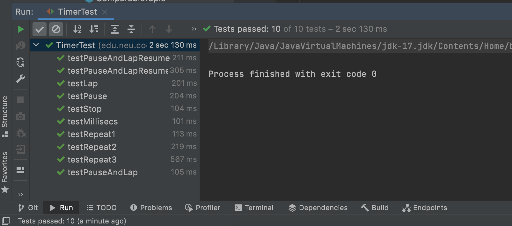
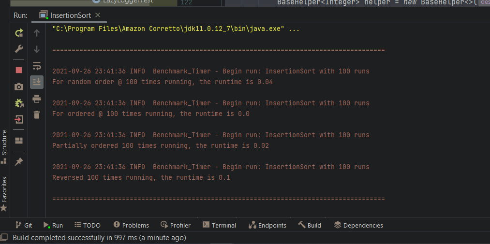

### `Noctis Yamazaki Zhang (NUID: 002105657)          `

# INFO 6205 Program Structures & Algorithms [Fall 2021]

## Assignment 2 (Benchmark)

### 1. *Timer* Class Implementation

The benchmark provided in the `Benchmark_Timer` has passed, by running on `Windows 10 21H2` with `Ryzen 5900X` coupled with `Amazon Corretto 11.0.12_7`. Result can be witness as:


The benchmark provided in the `InsertionSortTest` has passed, by running on `Windows 10 21H2` with `Ryzen 5900X` coupled with `Amazon Corretto 11.0.12_7`. Result can be witness as:


The benchmark provided in the `Benchmark_Timer` has passed, by running on `Macos 11.12.5` with `Intel i7-7920HQ` coupled with `Oracle JDK 17`. Result can be witness as:

Do notice that for whatever unknown reasons, even though the Windows platform was able to finish tasks sooner, but failed on `testRepeat2` and `testRepeat3`. Which the Intel platform does not seem to have such issue.



The code which has been implemented is:

```java
    /**
     * Pause (without counting a lap); run the given functions n times while being timed, i.e. once per "lap", and finally return the result of calling meanLapTime().
     *
     * @param n            the number of repetitions.
     * @param supplier     a function which supplies a T value.
     * @param function     a function T=>U and which is to be timed.
     * @param preFunction  a function which pre-processes a T value and which precedes the call of function, but which is not timed (may be null).
     * @param postFunction a function which consumes a U and which succeeds the call of function, but which is not timed (may be null).
     * @return the average milliseconds per repetition.
     */
    public <T, U> double repeat(int n, Supplier<T> supplier, Function<T, U> function, UnaryOperator<T> preFunction, Consumer<U> postFunction) {
        logger.trace("repeat: with " + n + " runs");
        // TO BE IMPLEMENTED: note that the timer is running when this method is called and should still be running when it returns.

        // Initialize a pause before the interation of loops
        pause();
        // Might be wrong

        // Then it is safe to start the iteration
//        for (int i = 0; i < n; i ++) {
//
//            pause();
//
//            // Use T class trigger get
//            T tt = supplier.get();
//            resume();
//
//            // check if not null
//            if (preFunction != null) {
//
//                pause();
//
//                // Apply tt
//
//                preFunction.apply(tt);
//                resume();
//
//            }
//
//
//            U uu = function.apply(tt);
//
//            // Trigger pause and lap
//            pauseAndLap();
//
//            // Essentially time to stop here
//            if (postFunction != null) {
//                pause();
//                postFunction.accept(uu);
//                resume();
//            }
//
//        }
//
//        pause();
//
//        double finalt = meanLapTime();
//
//        resume();
//        return finalt;

        // Let's try something new
        // There should be 4 conditions we need to address
        
        // Otherwise, there can by null pointer issues
        int i = 0;
        // Check all four
        while(i < n) {
            if (preFunction == null && postFunction == null) {
                T t = supplier.get();

                resume();

                function.apply(t);

                pauseAndLap();

            } else if (preFunction == null && postFunction != null) {

                T t = supplier.get();
                resume();
                U u = function.apply(t);
                pauseAndLap();
                postFunction.accept(u);
            } else if (preFunction != null && postFunction == null) {

                T t = supplier.get();
                t = preFunction.apply(t);

                resume();

                function.apply(t);
                pauseAndLap();

            } else {

                T t = supplier.get();
                t = preFunction.apply(t);

                resume();

                U u = function.apply(t);
                pauseAndLap();
                postFunction.accept(u);
            }
            // Now plus one
            i++;
        }
        return meanLapTime();


        //return 0;
    }
```

The supplement functions are:

```java
    /**
     * Get the number of ticks from the system clock.
     * <p>
     * NOTE: (Maintain consistency) There are two system methods for getting the clock time.
     * Ensure that this method is consistent with toMillisecs.
     *
     * @return the number of ticks for the system clock. Currently defined as nano time.
     */
    private static long getClock() {
        // TO BE IMPLEMENTED

        // I guess just return with nano time
        return System.nanoTime();
        //return 0;
    }

    /**
     * NOTE: (Maintain consistency) There are two system methods for getting the clock time.
     * Ensure that this method is consistent with getTicks.
     *
     * @param ticks the number of clock ticks -- currently in nanoseconds.
     * @return the corresponding number of milliseconds.
     */
    private static double toMillisecs(long ticks) {
        // TO BE IMPLEMENTED

        //return ((double) ticks / 1000000);

        return (Math.max(0L, Math.round(ticks / 1000000.0d)));

        // return 0;
    }
```

When it comes to the benchmark for arrays under various conditions, the benchmark result can be seen as



### ==The code being developed is nested under `InsertionSort.java`:==

```java
    /**
     * The benchmark for various conditions
     */

    public static void main(String[] args) throws IOException {
        int NumOfRuns = 0;

        int[] testCases = new int[] {100, 400, 1600, 6400, 25600, 102400, 409600};

        // Starting with 10000
        for(int t = 0; t < testCases.length; t++) {
            NumOfRuns = testCases[t];
            int iterationCount = NumOfRuns;


            BaseHelper<Integer> helper = new BaseHelper<>("InsertionSort", iterationCount, Config.load(InsertionSort.class));

            SortWithHelper<Integer> sorter = new InsertionSort<>(helper);

            Benchmark<Integer[]> benchmarkTimer = new Benchmark_Timer<>("InsertionSort", sorter::preProcess, sorter::sort);


            // For random order test
            System.out.println("");
            System.out.println("======================================================================================");
            System.out.println("");
            double randomOrderTest = benchmarkTimer.run(helper.random(Integer.class, r -> r.nextInt(iterationCount)), NumOfRuns);
            System.out.println("For random order @ " + iterationCount + " times running," + " the runtime is " + randomOrderTest);

            System.out.println("");
//            System.out.println("======================================================================================");

            // Now, we run the ordered array test
            Integer[] numberIncreasingArray = new Integer[iterationCount];
            for (int i = 0; i < iterationCount; i++) {

                // Simply copy over
                numberIncreasingArray[i] = i;
            }

            double orderedArrayTest = benchmarkTimer.run(numberIncreasingArray, NumOfRuns);
//            System.out.println("");
            System.out.println("For ordered @ " + iterationCount + " times running," + " the runtime is " + orderedArrayTest);

//            System.out.println("");
//            System.out.println("======================================================================================");
            System.out.println("");

            // For the partially ordered array
            Integer[] messyArray = helper.random(Integer.class, r -> r.nextInt(iterationCount));
            Arrays.sort(messyArray, messyArray.length / 3, messyArray.length * 2 / 3);

            double partiallyOrderedTest = benchmarkTimer.run(messyArray, NumOfRuns);
            System.out.println("Partially ordered " + iterationCount + " times running," + " the runtime is " + partiallyOrderedTest);

            // Now we flip it and run
            Integer[] flippedArray = new Integer[iterationCount];
            for (int i = 0; i < iterationCount; i++) {
                flippedArray[i] = iterationCount - (i + 1);
            }

            System.out.println("");

            double flippedOrderTest = benchmarkTimer.run(flippedArray, NumOfRuns);
            System.out.println("Reversed " + iterationCount + " times running," + " the runtime is " + flippedOrderTest);
        }
    }
```


### 2. Conclusion Regarding the Relationship

When it comes to the runtime requirement for each array condition, the order should be

`Ordered Array` < `Partially-Ordered Array` ≈ `Random Array` < `Reverse-Ordered Array`.

The complexity and runtime should follow:

|                    | Ordered Array | Partially-Ordered Array | Random Array         | Reverse-Ordered Array |
| ------------------ | ------------- | ----------------------- | -------------------- | --------------------- |
| Runtime Complexity | $O(N)$        | $O(N) \ to \ O(N^2)$    | $O(N) \ to \ O(N^2)$ | $O(N^2)$              |

Detailed information can be seen as:

```bash
======================================================================================

2021-09-26 23:41:36 INFO  Benchmark_Timer - Begin run: InsertionSort with 200 runs
For random order @ 100 times running, the runtime is 0.10623

2021-09-26 23:41:36 INFO  Benchmark_Timer - Begin run: InsertionSort with 200 runs
For ordered @ 100 times running, the runtime is 0.005118

2021-09-26 23:41:36 INFO  Benchmark_Timer - Begin run: InsertionSort with 200 runs
Partially ordered 100 times running, the runtime is 0.022323

2021-09-26 23:41:36 INFO  Benchmark_Timer - Begin run: InsertionSort with 200 runs
Reversed 100 times running, the runtime is 0.1112104

======================================================================================

2021-09-26 23:41:36 INFO  Benchmark_Timer - Begin run: InsertionSort with 400 runs
For random order @ 400 times running, the runtime is 0.1225

2021-09-26 23:41:36 INFO  Benchmark_Timer - Begin run: InsertionSort with 400 runs
For ordered @ 400 times running, the runtime is 0.0025

2021-09-26 23:41:36 INFO  Benchmark_Timer - Begin run: InsertionSort with 400 runs
Partially ordered 400 times running, the runtime is 0.105

2021-09-26 23:41:36 INFO  Benchmark_Timer - Begin run: InsertionSort with 400 runs
Reversed 400 times running, the runtime is 0.24

======================================================================================

2021-09-26 23:41:36 INFO  Benchmark_Timer - Begin run: InsertionSort with 1,600 runs
For random order @ 1600 times running, the runtime is 1.929375

2021-09-26 23:41:39 INFO  Benchmark_Timer - Begin run: InsertionSort with 1,600 runs
For ordered @ 1600 times running, the runtime is 0.00625

2021-09-26 23:41:39 INFO  Benchmark_Timer - Begin run: InsertionSort with 1,600 runs
Partially ordered 1600 times running, the runtime is 1.111875

2021-09-26 23:41:41 INFO  Benchmark_Timer - Begin run: InsertionSort with 1,600 runs
Reversed 1600 times running, the runtime is 2.06

======================================================================================

2021-09-26 23:41:44 INFO  Benchmark_Timer - Begin run: InsertionSort with 6,400 runs
For random order @ 6400 times running, the runtime is 17.89921875

2021-09-26 23:43:39 INFO  Benchmark_Timer - Begin run: InsertionSort with 6,400 runs
For ordered @ 6400 times running, the runtime is 0.0159375

2021-09-26 23:43:39 INFO  Benchmark_Timer - Begin run: InsertionSort with 6,400 runs
Partially ordered 6400 times running, the runtime is 15.9234375

2021-09-26 23:45:21 INFO  Benchmark_Timer - Begin run: InsertionSort with 6,400 runs
Reversed 6400 times running, the runtime is 34.741875

======================================================================================

2021-09-26 23:49:03 INFO  Benchmark_Timer - Begin run: InsertionSort with 25,600 runs

```


