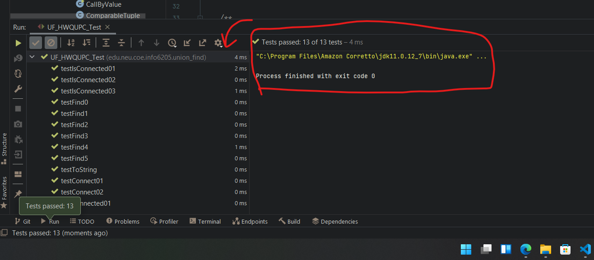
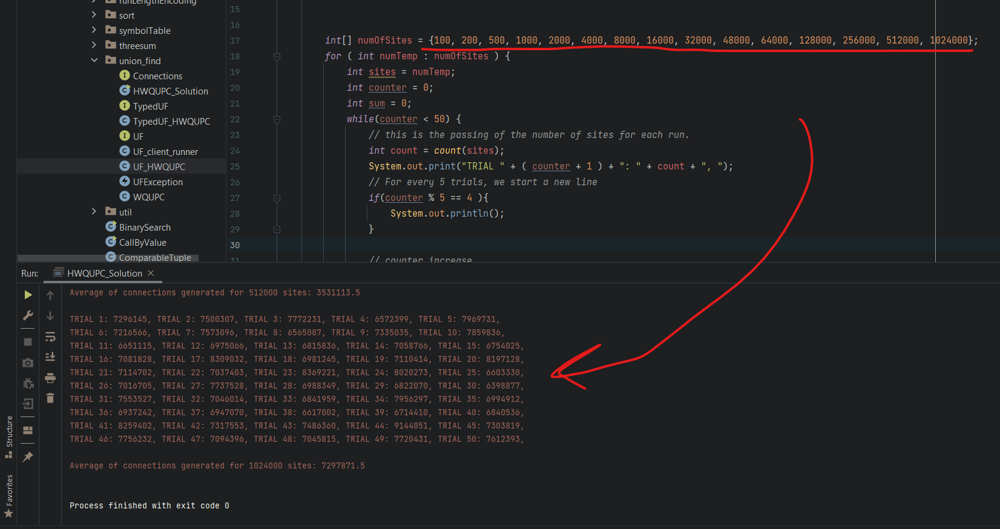
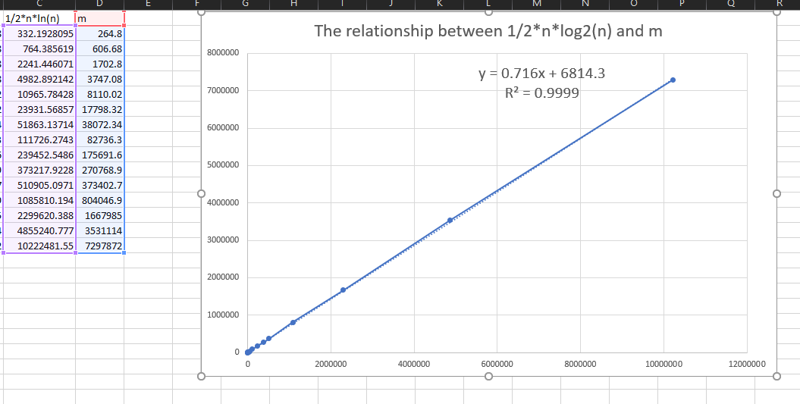
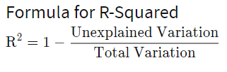

### `Noctis Yamazaki Zhang (NUID: 002105657)          `

# INFO 6205 Program Structures & Algorithms [Fall 2021]

## Assignment 3 (WQUPC)

### 1. Tasks:

#### 1.1 Step 1

> (a) Implement height-weighted Quick Union with Path Compression. For this, you will flesh out the class UF_HWQUPC. All you have to do is to fill in the sections marked with // TO BE IMPLEMENTED ... // ...END IMPLEMENTATION.

**The code can be seen under the file named `UF_HWQUPC.java`.**

The codes in question are:

```java
    /**
     * Returns the component identifier for the component containing site {@code p}.
     *
     * @param p the integer representing one site
     * @return the component identifier for the component containing site {@code p}
     * @throws IllegalArgumentException unless {@code 0 <= p < n}
     */
    public int find(int p) {
        validate(p);
        int root = p;
        // TO BE IMPLEMENTED

        // using a while loop till the root is the same of the root of the parent, my english sucks
        while (root != parent[root]) {

            // Use the simple boolean checker
            if (pathCompression) {
                // go down the hill
                doPathCompression(root);


                // Dumb fuck for leaving it here. It should be executed regardless
                //root = parent[root];
            }

            root = parent[root];
        }

        // This time, we do need to return the root as the result of the function
        return root;
    }
```

```java
    private void mergeComponents(int i, int j) {
        // TO BE IMPLEMENTED make shorter root point to taller one
        // If both hand sides are the same
        if (i == j) {
            // no shit needs to be done

            // Not sure if necessary
            // count++;
            // height[i]++;

            return;
        }

        // Then we need to check the height of the thing
        // Fucking hell for forgetting the equal condition.

        if (height[i] >= height[j]) {

            // Use the existing function
            updateParent(j, i);
            updateHeight(i, j);

        } else {

            // Reverse order
            updateParent(i, j);
            updateHeight(j, i);

            // I don't know if I am thinking this wrong
        }
    }
```

```java
    /**
     * This implements the single-pass path-halving mechanism of path compression
     */
    private void doPathCompression(int i) {
        // TO BE IMPLEMENTED update parent to value of grandparent
        updateParent(i, parent[parent[i]]);
    }
```


> (b) Check that the unit tests for this class all work. You must show "green" test results in your submission (screenshot is OK). 



#### 1.2 Step 2

**The implementation can be found in the `HWQUPC_Solution.java`.**

No terminal input function is implemented as I am aiming to sweep through an array of numbers for generating the results in `Step 3`.

#### 1.3 Step 3 

15 different numbers of sites have been ran through the program to determine the relationship between the number of object ($n$) and the number of pairs ($m$). For each $n$, ==100== runs were conducted, and an average value was calculated to make the result more generalized.



The results can be found in the ==Exhibition A==.

### **The relationship between $n$ and $m$ shall be $$m \ ≈ \ \frac{1}{2} * n  *   log_2 n .$$** Such can be seen from the plot and analysis down below.



By adding a linear trendline, I find out that the $R^2$ value is almost `1`.

> R-squared ($R^2$) is a statistical measure that represents the proportion of the variance for a dependent variable that's explained by an independent variable or variables in a [regression](https://www.investopedia.com/terms/r/regression.asp) model. Whereas correlation explains the strength of the relationship between an independent and dependent variable, R-squared explains to what extent the variance of one variable explains the variance of the second variable. So, if the R2 of a model is 0.50, then approximately half of the observed variation can be explained by the model's inputs.                 --------- [R-Squared Definition (investopedia.com)](https://www.investopedia.com/terms/r/r-squared.asp)

The equation can be seen as:



In this case, nearly 99.99% of observations fall into a linear relationship for $\frac{1}{2} * n  *   log_2 n$ and $m$, which confirms the relationship to be valid.


## Exhibition A

```bash
"C:\Program Files\Amazon Corretto\jdk11.0.12_7\bin\java.exe" "-javaagent:C:\Program Files\JetBrains\IntelliJ IDEA 2021.2\lib\idea_rt.jar=1026:C:\Program Files\JetBrains\IntelliJ IDEA 2021.2\bin" -Dfile.encoding=UTF-8 -classpath D:\GitHub\INFO-6205\target\classes;C:\Users\nkyam\.m2\repository\org\apache\logging\log4j\log4j-api\2.14.1\log4j-api-2.14.1.jar;C:\Users\nkyam\.m2\repository\log4j\log4j\1.2.17\log4j-1.2.17.jar;C:\Users\nkyam\.m2\repository\com\google\guava\guava\30.1.1-jre\guava-30.1.1-jre.jar;C:\Users\nkyam\.m2\repository\com\google\guava\failureaccess\1.0.1\failureaccess-1.0.1.jar;C:\Users\nkyam\.m2\repository\com\google\guava\listenablefuture\9999.0-empty-to-avoid-conflict-with-guava\listenablefuture-9999.0-empty-to-avoid-conflict-with-guava.jar;C:\Users\nkyam\.m2\repository\com\google\code\findbugs\jsr305\3.0.2\jsr305-3.0.2.jar;C:\Users\nkyam\.m2\repository\org\checkerframework\checker-qual\3.8.0\checker-qual-3.8.0.jar;C:\Users\nkyam\.m2\repository\com\google\errorprone\error_prone_annotations\2.5.1\error_prone_annotations-2.5.1.jar;C:\Users\nkyam\.m2\repository\com\google\j2objc\j2objc-annotations\1.3\j2objc-annotations-1.3.jar;C:\Users\nkyam\.m2\repository\org\ini4j\ini4j\0.5.4\ini4j-0.5.4.jar edu.neu.coe.info6205.union_find.HWQUPC_Solution
TRIAL 1: 226, TRIAL 2: 255, TRIAL 3: 185, TRIAL 4: 245, TRIAL 5: 232, 
TRIAL 6: 311, TRIAL 7: 243, TRIAL 8: 226, TRIAL 9: 230, TRIAL 10: 225, 
TRIAL 11: 291, TRIAL 12: 202, TRIAL 13: 224, TRIAL 14: 208, TRIAL 15: 236, 
TRIAL 16: 237, TRIAL 17: 394, TRIAL 18: 197, TRIAL 19: 293, TRIAL 20: 203, 
TRIAL 21: 324, TRIAL 22: 216, TRIAL 23: 238, TRIAL 24: 265, TRIAL 25: 218, 
TRIAL 26: 213, TRIAL 27: 221, TRIAL 28: 248, TRIAL 29: 197, TRIAL 30: 286, 
TRIAL 31: 175, TRIAL 32: 245, TRIAL 33: 212, TRIAL 34: 349, TRIAL 35: 280, 
TRIAL 36: 293, TRIAL 37: 317, TRIAL 38: 190, TRIAL 39: 397, TRIAL 40: 315, 
TRIAL 41: 201, TRIAL 42: 514, TRIAL 43: 262, TRIAL 44: 298, TRIAL 45: 387, 
TRIAL 46: 258, TRIAL 47: 348, TRIAL 48: 272, TRIAL 49: 315, TRIAL 50: 323, 

Average of connections generated for 100 sites: 264.8

TRIAL 1: 606, TRIAL 2: 797, TRIAL 3: 955, TRIAL 4: 683, TRIAL 5: 594, 
TRIAL 6: 791, TRIAL 7: 639, TRIAL 8: 799, TRIAL 9: 480, TRIAL 10: 591, 
TRIAL 11: 505, TRIAL 12: 573, TRIAL 13: 588, TRIAL 14: 637, TRIAL 15: 548, 
TRIAL 16: 639, TRIAL 17: 678, TRIAL 18: 633, TRIAL 19: 638, TRIAL 20: 758, 
TRIAL 21: 456, TRIAL 22: 553, TRIAL 23: 528, TRIAL 24: 436, TRIAL 25: 525, 
TRIAL 26: 729, TRIAL 27: 491, TRIAL 28: 631, TRIAL 29: 461, TRIAL 30: 451, 
TRIAL 31: 559, TRIAL 32: 548, TRIAL 33: 566, TRIAL 34: 562, TRIAL 35: 821, 
TRIAL 36: 604, TRIAL 37: 685, TRIAL 38: 416, TRIAL 39: 549, TRIAL 40: 531, 
TRIAL 41: 568, TRIAL 42: 610, TRIAL 43: 692, TRIAL 44: 495, TRIAL 45: 760, 
TRIAL 46: 538, TRIAL 47: 768, TRIAL 48: 459, TRIAL 49: 427, TRIAL 50: 783, 

Average of connections generated for 200 sites: 606.68

TRIAL 1: 1768, TRIAL 2: 1627, TRIAL 3: 2197, TRIAL 4: 1799, TRIAL 5: 2010, 
TRIAL 6: 1778, TRIAL 7: 1258, TRIAL 8: 1268, TRIAL 9: 2097, TRIAL 10: 1516, 
TRIAL 11: 1230, TRIAL 12: 1473, TRIAL 13: 1626, TRIAL 14: 1661, TRIAL 15: 2034, 
TRIAL 16: 1795, TRIAL 17: 2034, TRIAL 18: 1501, TRIAL 19: 1566, TRIAL 20: 1539, 
TRIAL 21: 1585, TRIAL 22: 1771, TRIAL 23: 1853, TRIAL 24: 1625, TRIAL 25: 1902, 
TRIAL 26: 2860, TRIAL 27: 1398, TRIAL 28: 1437, TRIAL 29: 2165, TRIAL 30: 1822, 
TRIAL 31: 1494, TRIAL 32: 2277, TRIAL 33: 1707, TRIAL 34: 1493, TRIAL 35: 1824, 
TRIAL 36: 1440, TRIAL 37: 1341, TRIAL 38: 1799, TRIAL 39: 1457, TRIAL 40: 1440, 
TRIAL 41: 1837, TRIAL 42: 1635, TRIAL 43: 1886, TRIAL 44: 1364, TRIAL 45: 1470, 
TRIAL 46: 1508, TRIAL 47: 1778, TRIAL 48: 1839, TRIAL 49: 1613, TRIAL 50: 1743, 

Average of connections generated for 500 sites: 1702.8

TRIAL 1: 4173, TRIAL 2: 3532, TRIAL 3: 2868, TRIAL 4: 3093, TRIAL 5: 4527, 
TRIAL 6: 4185, TRIAL 7: 3939, TRIAL 8: 3008, TRIAL 9: 3344, TRIAL 10: 3518, 
TRIAL 11: 4289, TRIAL 12: 3124, TRIAL 13: 3760, TRIAL 14: 2646, TRIAL 15: 3862, 
TRIAL 16: 4460, TRIAL 17: 4120, TRIAL 18: 4378, TRIAL 19: 4486, TRIAL 20: 3029, 
TRIAL 21: 4438, TRIAL 22: 6950, TRIAL 23: 3219, TRIAL 24: 3213, TRIAL 25: 4190, 
TRIAL 26: 4207, TRIAL 27: 3471, TRIAL 28: 3929, TRIAL 29: 3199, TRIAL 30: 3373, 
TRIAL 31: 3310, TRIAL 32: 4693, TRIAL 33: 2692, TRIAL 34: 4011, TRIAL 35: 4725, 
TRIAL 36: 3710, TRIAL 37: 4265, TRIAL 38: 3648, TRIAL 39: 3878, TRIAL 40: 4253, 
TRIAL 41: 2967, TRIAL 42: 3411, TRIAL 43: 3988, TRIAL 44: 3918, TRIAL 45: 2928, 
TRIAL 46: 2868, TRIAL 47: 3834, TRIAL 48: 2950, TRIAL 49: 3457, TRIAL 50: 3318, 

Average of connections generated for 1000 sites: 3747.08

TRIAL 1: 7322, TRIAL 2: 7682, TRIAL 3: 6358, TRIAL 4: 7099, TRIAL 5: 8466, 
TRIAL 6: 10313, TRIAL 7: 9391, TRIAL 8: 9374, TRIAL 9: 7265, TRIAL 10: 6562, 
TRIAL 11: 7073, TRIAL 12: 8131, TRIAL 13: 10938, TRIAL 14: 6850, TRIAL 15: 9231, 
TRIAL 16: 8579, TRIAL 17: 6741, TRIAL 18: 8455, TRIAL 19: 9783, TRIAL 20: 8169, 
TRIAL 21: 7651, TRIAL 22: 13192, TRIAL 23: 8999, TRIAL 24: 8694, TRIAL 25: 6744, 
TRIAL 26: 9312, TRIAL 27: 6814, TRIAL 28: 6809, TRIAL 29: 6391, TRIAL 30: 7490, 
TRIAL 31: 7007, TRIAL 32: 6887, TRIAL 33: 7098, TRIAL 34: 8490, TRIAL 35: 9309, 
TRIAL 36: 9772, TRIAL 37: 7392, TRIAL 38: 7340, TRIAL 39: 8136, TRIAL 40: 7043, 
TRIAL 41: 7521, TRIAL 42: 7883, TRIAL 43: 9171, TRIAL 44: 10950, TRIAL 45: 6807, 
TRIAL 46: 7614, TRIAL 47: 7080, TRIAL 48: 10008, TRIAL 49: 7213, TRIAL 50: 6902, 

Average of connections generated for 2000 sites: 8110.02

TRIAL 1: 18214, TRIAL 2: 19455, TRIAL 3: 16704, TRIAL 4: 16191, TRIAL 5: 15257, 
TRIAL 6: 18059, TRIAL 7: 15491, TRIAL 8: 19937, TRIAL 9: 15535, TRIAL 10: 20580, 
TRIAL 11: 23582, TRIAL 12: 18005, TRIAL 13: 17203, TRIAL 14: 16943, TRIAL 15: 22721, 
TRIAL 16: 15597, TRIAL 17: 19256, TRIAL 18: 14175, TRIAL 19: 13721, TRIAL 20: 15965, 
TRIAL 21: 15513, TRIAL 22: 18021, TRIAL 23: 14915, TRIAL 24: 17242, TRIAL 25: 17921, 
TRIAL 26: 21758, TRIAL 27: 15718, TRIAL 28: 19923, TRIAL 29: 18693, TRIAL 30: 20350, 
TRIAL 31: 17634, TRIAL 32: 17335, TRIAL 33: 21542, TRIAL 34: 17868, TRIAL 35: 20775, 
TRIAL 36: 18620, TRIAL 37: 19053, TRIAL 38: 18120, TRIAL 39: 13472, TRIAL 40: 15748, 
TRIAL 41: 23558, TRIAL 42: 17108, TRIAL 43: 14457, TRIAL 44: 16049, TRIAL 45: 13755, 
TRIAL 46: 18434, TRIAL 47: 18323, TRIAL 48: 18068, TRIAL 49: 17153, TRIAL 50: 20199, 

Average of connections generated for 4000 sites: 17798.32

TRIAL 1: 34548, TRIAL 2: 44948, TRIAL 3: 40029, TRIAL 4: 32330, TRIAL 5: 40407, 
TRIAL 6: 37611, TRIAL 7: 49759, TRIAL 8: 35872, TRIAL 9: 47259, TRIAL 10: 36307, 
TRIAL 11: 38841, TRIAL 12: 39175, TRIAL 13: 37404, TRIAL 14: 37706, TRIAL 15: 45274, 
TRIAL 16: 40274, TRIAL 17: 41466, TRIAL 18: 37259, TRIAL 19: 34949, TRIAL 20: 44363, 
TRIAL 21: 43437, TRIAL 22: 37130, TRIAL 23: 32476, TRIAL 24: 44096, TRIAL 25: 46592, 
TRIAL 26: 38029, TRIAL 27: 35717, TRIAL 28: 30839, TRIAL 29: 41049, TRIAL 30: 30798, 
TRIAL 31: 38221, TRIAL 32: 37170, TRIAL 33: 35663, TRIAL 34: 32167, TRIAL 35: 43393, 
TRIAL 36: 33850, TRIAL 37: 41924, TRIAL 38: 43717, TRIAL 39: 33432, TRIAL 40: 42538, 
TRIAL 41: 39239, TRIAL 42: 34818, TRIAL 43: 32864, TRIAL 44: 32271, TRIAL 45: 34201, 
TRIAL 46: 35635, TRIAL 47: 32736, TRIAL 48: 32889, TRIAL 49: 38918, TRIAL 50: 32027, 

Average of connections generated for 8000 sites: 38072.34

TRIAL 1: 69786, TRIAL 2: 68510, TRIAL 3: 93235, TRIAL 4: 80926, TRIAL 5: 78603, 
TRIAL 6: 76841, TRIAL 7: 75802, TRIAL 8: 85756, TRIAL 9: 84709, TRIAL 10: 91158, 
TRIAL 11: 94079, TRIAL 12: 98621, TRIAL 13: 79063, TRIAL 14: 74046, TRIAL 15: 87896, 
TRIAL 16: 73122, TRIAL 17: 80880, TRIAL 18: 96109, TRIAL 19: 79960, TRIAL 20: 78008, 
TRIAL 21: 89283, TRIAL 22: 87024, TRIAL 23: 91015, TRIAL 24: 86153, TRIAL 25: 92491, 
TRIAL 26: 90487, TRIAL 27: 70045, TRIAL 28: 82845, TRIAL 29: 91927, TRIAL 30: 96971, 
TRIAL 31: 96760, TRIAL 32: 77978, TRIAL 33: 89196, TRIAL 34: 71873, TRIAL 35: 71286, 
TRIAL 36: 73802, TRIAL 37: 73109, TRIAL 38: 79057, TRIAL 39: 78366, TRIAL 40: 74295, 
TRIAL 41: 72092, TRIAL 42: 92260, TRIAL 43: 75341, TRIAL 44: 77272, TRIAL 45: 74778, 
TRIAL 46: 82641, TRIAL 47: 82242, TRIAL 48: 78376, TRIAL 49: 92855, TRIAL 50: 97885, 

Average of connections generated for 16000 sites: 82736.3

TRIAL 1: 145726, TRIAL 2: 165889, TRIAL 3: 178858, TRIAL 4: 201968, TRIAL 5: 173037, 
TRIAL 6: 164714, TRIAL 7: 190375, TRIAL 8: 170996, TRIAL 9: 167149, TRIAL 10: 168706, 
TRIAL 11: 207635, TRIAL 12: 159331, TRIAL 13: 169951, TRIAL 14: 150384, TRIAL 15: 160985, 
TRIAL 16: 194238, TRIAL 17: 190292, TRIAL 18: 194345, TRIAL 19: 197601, TRIAL 20: 211522, 
TRIAL 21: 165433, TRIAL 22: 180248, TRIAL 23: 203872, TRIAL 24: 175049, TRIAL 25: 179945, 
TRIAL 26: 180778, TRIAL 27: 191504, TRIAL 28: 164785, TRIAL 29: 148173, TRIAL 30: 166831, 
TRIAL 31: 179799, TRIAL 32: 166029, TRIAL 33: 199121, TRIAL 34: 154348, TRIAL 35: 169213, 
TRIAL 36: 149902, TRIAL 37: 164099, TRIAL 38: 194269, TRIAL 39: 168244, TRIAL 40: 197953, 
TRIAL 41: 150542, TRIAL 42: 167325, TRIAL 43: 176764, TRIAL 44: 154271, TRIAL 45: 171796, 
TRIAL 46: 192674, TRIAL 47: 189742, TRIAL 48: 171285, TRIAL 49: 163203, TRIAL 50: 183679, 

Average of connections generated for 32000 sites: 175691.56

TRIAL 1: 261701, TRIAL 2: 264941, TRIAL 3: 279161, TRIAL 4: 288153, TRIAL 5: 265108, 
TRIAL 6: 275300, TRIAL 7: 279422, TRIAL 8: 249489, TRIAL 9: 319196, TRIAL 10: 312181, 
TRIAL 11: 259304, TRIAL 12: 271610, TRIAL 13: 257740, TRIAL 14: 265576, TRIAL 15: 285912, 
TRIAL 16: 252146, TRIAL 17: 252578, TRIAL 18: 305124, TRIAL 19: 282156, TRIAL 20: 323049, 
TRIAL 21: 252156, TRIAL 22: 223613, TRIAL 23: 259996, TRIAL 24: 244894, TRIAL 25: 268668, 
TRIAL 26: 317410, TRIAL 27: 260899, TRIAL 28: 218421, TRIAL 29: 285196, TRIAL 30: 348049, 
TRIAL 31: 270573, TRIAL 32: 274405, TRIAL 33: 230833, TRIAL 34: 254895, TRIAL 35: 256683, 
TRIAL 36: 321174, TRIAL 37: 244268, TRIAL 38: 244658, TRIAL 39: 243221, TRIAL 40: 283274, 
TRIAL 41: 239190, TRIAL 42: 234476, TRIAL 43: 282074, TRIAL 44: 254937, TRIAL 45: 265853, 
TRIAL 46: 246120, TRIAL 47: 353242, TRIAL 48: 264149, TRIAL 49: 268457, TRIAL 50: 276812, 

Average of connections generated for 48000 sites: 270768.88

TRIAL 1: 346080, TRIAL 2: 466783, TRIAL 3: 348334, TRIAL 4: 356051, TRIAL 5: 344702, 
TRIAL 6: 370562, TRIAL 7: 306204, TRIAL 8: 379857, TRIAL 9: 331297, TRIAL 10: 359936, 
TRIAL 11: 439374, TRIAL 12: 331793, TRIAL 13: 354975, TRIAL 14: 491339, TRIAL 15: 365901, 
TRIAL 16: 349565, TRIAL 17: 434787, TRIAL 18: 349465, TRIAL 19: 368976, TRIAL 20: 410193, 
TRIAL 21: 362573, TRIAL 22: 353799, TRIAL 23: 314510, TRIAL 24: 358198, TRIAL 25: 353672, 
TRIAL 26: 412087, TRIAL 27: 384452, TRIAL 28: 425923, TRIAL 29: 326652, TRIAL 30: 320070, 
TRIAL 31: 425656, TRIAL 32: 318056, TRIAL 33: 323714, TRIAL 34: 543350, TRIAL 35: 322328, 
TRIAL 36: 350686, TRIAL 37: 342907, TRIAL 38: 370248, TRIAL 39: 456222, TRIAL 40: 365511, 
TRIAL 41: 434268, TRIAL 42: 398309, TRIAL 43: 352840, TRIAL 44: 330648, TRIAL 45: 359170, 
TRIAL 46: 366696, TRIAL 47: 353759, TRIAL 48: 436685, TRIAL 49: 364142, TRIAL 50: 336832, 

Average of connections generated for 64000 sites: 373402.72

TRIAL 1: 747194, TRIAL 2: 819902, TRIAL 3: 715294, TRIAL 4: 687501, TRIAL 5: 778435, 
TRIAL 6: 811794, TRIAL 7: 748341, TRIAL 8: 734913, TRIAL 9: 735925, TRIAL 10: 933166, 
TRIAL 11: 956443, TRIAL 12: 822608, TRIAL 13: 887365, TRIAL 14: 880463, TRIAL 15: 738516, 
TRIAL 16: 710417, TRIAL 17: 764782, TRIAL 18: 893810, TRIAL 19: 749768, TRIAL 20: 825381, 
TRIAL 21: 858004, TRIAL 22: 748542, TRIAL 23: 727496, TRIAL 24: 726614, TRIAL 25: 875672, 
TRIAL 26: 769794, TRIAL 27: 1012378, TRIAL 28: 719376, TRIAL 29: 751896, TRIAL 30: 710656, 
TRIAL 31: 872270, TRIAL 32: 880135, TRIAL 33: 833593, TRIAL 34: 914007, TRIAL 35: 723445, 
TRIAL 36: 831287, TRIAL 37: 968340, TRIAL 38: 768294, TRIAL 39: 740622, TRIAL 40: 830320, 
TRIAL 41: 751987, TRIAL 42: 809234, TRIAL 43: 703014, TRIAL 44: 842825, TRIAL 45: 870923, 
TRIAL 46: 753705, TRIAL 47: 831782, TRIAL 48: 768886, TRIAL 49: 844671, TRIAL 50: 820560, 

Average of connections generated for 128000 sites: 804046.9

TRIAL 1: 1718387, TRIAL 2: 1785588, TRIAL 3: 1565206, TRIAL 4: 1724632, TRIAL 5: 1701814, 
TRIAL 6: 1836951, TRIAL 7: 1626742, TRIAL 8: 1851791, TRIAL 9: 1470514, TRIAL 10: 1478094, 
TRIAL 11: 1901214, TRIAL 12: 1490958, TRIAL 13: 1514387, TRIAL 14: 1701650, TRIAL 15: 1913639, 
TRIAL 16: 1583405, TRIAL 17: 1775521, TRIAL 18: 1705890, TRIAL 19: 1734140, TRIAL 20: 1471329, 
TRIAL 21: 1694949, TRIAL 22: 1507275, TRIAL 23: 1447239, TRIAL 24: 1570215, TRIAL 25: 1797555, 
TRIAL 26: 1899409, TRIAL 27: 1622524, TRIAL 28: 1675158, TRIAL 29: 1762520, TRIAL 30: 1656713, 
TRIAL 31: 2065770, TRIAL 32: 1649573, TRIAL 33: 1525799, TRIAL 34: 1440700, TRIAL 35: 1703344, 
TRIAL 36: 1670978, TRIAL 37: 1568676, TRIAL 38: 1503822, TRIAL 39: 1549708, TRIAL 40: 1702263, 
TRIAL 41: 1578600, TRIAL 42: 1763202, TRIAL 43: 1742638, TRIAL 44: 1654739, TRIAL 45: 1469334, 
TRIAL 46: 1681697, TRIAL 47: 1781482, TRIAL 48: 1890733, TRIAL 49: 1688669, TRIAL 50: 1582116, 

Average of connections generated for 256000 sites: 1667985.0

TRIAL 1: 4064902, TRIAL 2: 3018460, TRIAL 3: 3726972, TRIAL 4: 3790196, TRIAL 5: 3553046, 
TRIAL 6: 3806753, TRIAL 7: 3163826, TRIAL 8: 3881539, TRIAL 9: 3530966, TRIAL 10: 3608416, 
TRIAL 11: 3567137, TRIAL 12: 3803343, TRIAL 13: 3378067, TRIAL 14: 3718864, TRIAL 15: 3253494, 
TRIAL 16: 3301477, TRIAL 17: 3031294, TRIAL 18: 3213202, TRIAL 19: 2947201, TRIAL 20: 3298616, 
TRIAL 21: 3969600, TRIAL 22: 4351709, TRIAL 23: 3290724, TRIAL 24: 3178323, TRIAL 25: 3583754, 
TRIAL 26: 3590154, TRIAL 27: 3348197, TRIAL 28: 3174554, TRIAL 29: 3783764, TRIAL 30: 3887355, 
TRIAL 31: 3167602, TRIAL 32: 3360768, TRIAL 33: 3643975, TRIAL 34: 3436846, TRIAL 35: 3239224, 
TRIAL 36: 3404274, TRIAL 37: 4013133, TRIAL 38: 4146769, TRIAL 39: 3524437, TRIAL 40: 3399978, 
TRIAL 41: 3265917, TRIAL 42: 3463511, TRIAL 43: 3344444, TRIAL 44: 4076303, TRIAL 45: 3738864, 
TRIAL 46: 3309285, TRIAL 47: 3475412, TRIAL 48: 3915918, TRIAL 49: 3651286, TRIAL 50: 3161821, 

Average of connections generated for 512000 sites: 3531113.5

TRIAL 1: 7296145, TRIAL 2: 7500307, TRIAL 3: 7772231, TRIAL 4: 6572399, TRIAL 5: 7969731, 
TRIAL 6: 7216566, TRIAL 7: 7573096, TRIAL 8: 6565087, TRIAL 9: 7335035, TRIAL 10: 7859836, 
TRIAL 11: 6651115, TRIAL 12: 6975066, TRIAL 13: 6815836, TRIAL 14: 7058766, TRIAL 15: 6754025, 
TRIAL 16: 7081828, TRIAL 17: 8309032, TRIAL 18: 6981245, TRIAL 19: 7110414, TRIAL 20: 8197128, 
TRIAL 21: 7114702, TRIAL 22: 7037403, TRIAL 23: 8369221, TRIAL 24: 8020273, TRIAL 25: 6603330, 
TRIAL 26: 7016705, TRIAL 27: 7737528, TRIAL 28: 6988349, TRIAL 29: 6822070, TRIAL 30: 6398877, 
TRIAL 31: 7553527, TRIAL 32: 7046014, TRIAL 33: 6841959, TRIAL 34: 7956297, TRIAL 35: 6994912, 
TRIAL 36: 6937242, TRIAL 37: 6947070, TRIAL 38: 6617002, TRIAL 39: 6714410, TRIAL 40: 6840536, 
TRIAL 41: 8259402, TRIAL 42: 7317553, TRIAL 43: 7486360, TRIAL 44: 9144851, TRIAL 45: 7303819, 
TRIAL 46: 7756232, TRIAL 47: 7094396, TRIAL 48: 7045815, TRIAL 49: 7720431, TRIAL 50: 7612393, 

Average of connections generated for 1024000 sites: 7297871.5


Process finished with exit code 0

```

