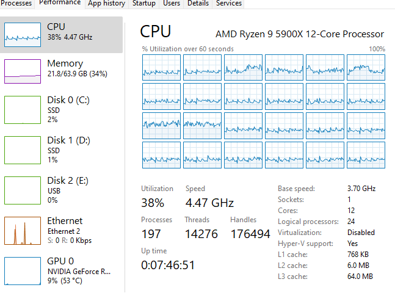
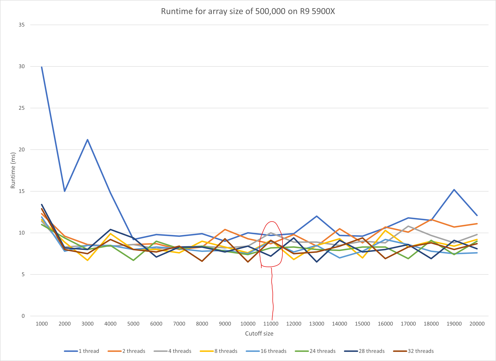
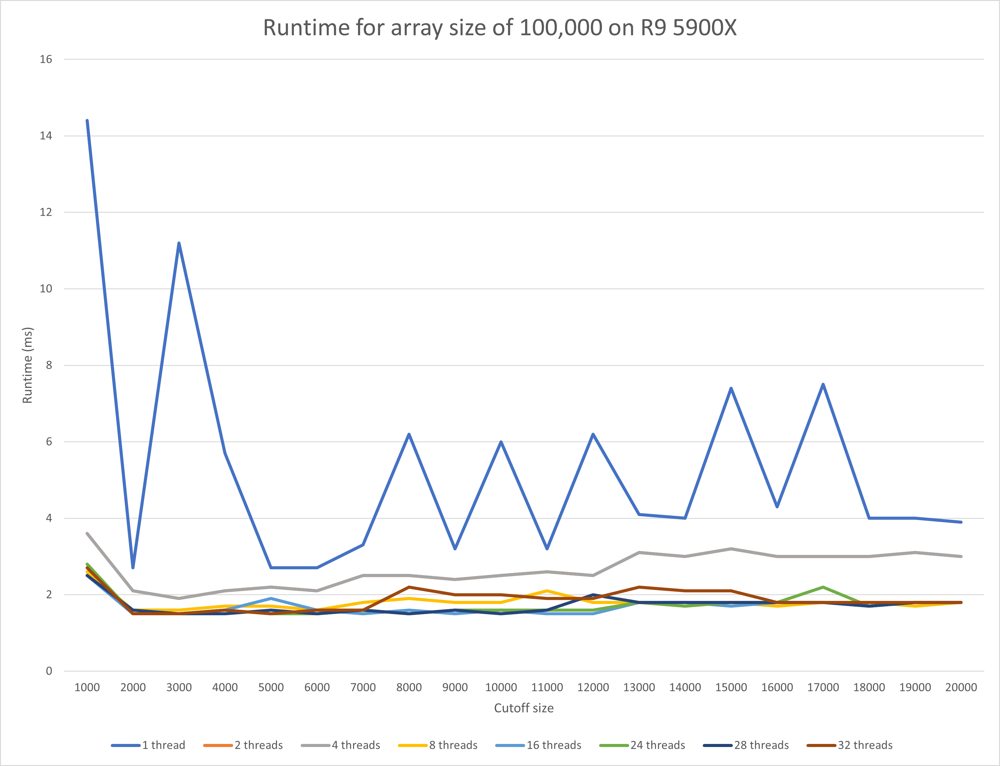
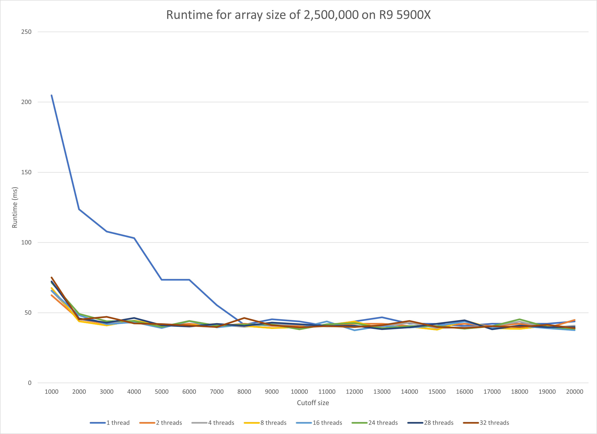

### `Noctis Yamazaki Zhang (NUID: 002105657)          `

# INFO 6205 Program Structures & Algorithms [Fall 2021]

## Assignment 5 (Parallel Sorting)

### 1. Tasks

Our task is to implement a parallel sorting algorithm such that each partition of the array is sorted in parallel. We will consider two different schemes for deciding whether to sort in parallel.

#### 1.1 Step 1

> 1. A cutoff (defaults to, say, 1000) which you will update according to the first argument in the command line when running. It's your job to experiment and come up with a good value for this cutoff. If there are fewer elements to sort than the cutoff, then you should use the system sort instead.

**The code can be seen under the file named `Main.java`.**

In this section of the experiment, I am sweep testing the cutoff value from `1000` to `20000` with an incremental step of `1000` for each time.

The codes in question are:

```java
			for (int j = 0; j < 20; j++) {
                ParSort.cutoff = 1000* (j + 1);
                // for (int i = 0; i < array.length; i++) array[i] = random.nextInt(10000000);
                long time;
                long startTime = System.currentTimeMillis();
                for (int t = 0; t < 10; t++) {
                    for (int i = 0; i < array.length; i++) array[i] = random.nextInt(10000000);

                    // update here
                    ParSort.sort(array, 0, array.length, pool);
                }
                long endTime = System.currentTimeMillis();
                time = (endTime - startTime);
                timeList.add(time);


                System.out.println("cutoff：" + (ParSort.cutoff) + "\t\t10times Time:" + time + "ms");

            }
            try {
                //FileOutputStream fis = new FileOutputStream("./src/result.csv");
                // Easy saving
                FileOutputStream fis = new FileOutputStream("./src/result_arrSize_" + arrSize + "_threadCount_" + threadCount + ".csv");
                OutputStreamWriter isr = new OutputStreamWriter(fis);
                BufferedWriter bw = new BufferedWriter(isr);
                int j = 0;
                for (long i : timeList) {
                    String content = (double) 10000 * (j + 1) / 2000000 + "," + (double) i / 10 + "\n";
                    j++;
                    bw.write(content);
                    bw.flush();
                }
                bw.close();

            } catch (IOException e) {
                e.printStackTrace();
            }

            // Update the threadcount
            if (threadCount == 1) {
                // Change from 1 to 2
                threadCount *= 2;
            } else {
                // increase by 2
                threadCount = threadCount + 2;
            }
```

#### 1.2 Step 2

> 1. Recursion depth or the number of available threads. Using this determination, you might decide on an ideal number (*t*) of separate threads (stick to powers of 2) and arrange for that number of partitions to be parallelized (by preventing recursion after the depth of *lg t* is reached).

**The code can be seen under the file named `Main.java` as shown above.**

However, instead of increasing the thread by power of 2, I did something different by adding 2. Here is my reasoning.

We do need to notice that not all CPUs are sharing a simple core count incremental rule by multiplying 2. In my case, I have an `INTEL i7-7920HQ`, an `AMD R9 5900X`, and an `AMD R9 5950X`. The specification of them is:

|                | INTEL i7-7920HQ | AMD R9 5900X | AMD R9 5950X |
| -------------- | --------------- | ------------ | ------------ |
| Core #         | 4               | 12           | 16           |
| Thread #       | 8               | 24           | 32           |
| Core Frequency | 3.1GHz          | 4.47 GHz     | 4.41GHz      |



Do notice that, for the AMD platforms, by enabling PBO max tuning and offset the power limit, I was able to lock the all core frequency to `4.47GHz` as for `AMD R9 5900X`. Therefore, the fluctuation of the CPU boost clock frequency is largely eliminated. As for the `INTEL i7-7920HQ`, no effective power limiting or tuning utility is available for macos, I was then running Cinebench R20 for all cores to fully thermal throttle the CPU cores to ensure that all cores are running at the CPU's base clock at `3.1GHz`.

#### 1.3 Step 1.3

> 1. An appropriate combination of these.

**The code can be seen under the file named `ParSort.java`.**

```java
/**
 * This code has been fleshed out by Ziyao Qiao. Thanks very much.
 * TODO tidy it up a bit.
 */
class ParSort {

    public static int cutoff = 1000;


    //public static void sort(int[] array, int from, int to) {
    public static void sort(int[] array, int from, int to, ForkJoinPool pool) {

        // Need to update the function call as well
        if (to - from < cutoff) Arrays.sort(array, from, to);
        else {
            // FIXME next few lines should be removed from public repo.
            CompletableFuture<int[]> parsort1 = parsort(array, from, from + (to - from) / 2, pool); // TO IMPLEMENT
            // Updated by adding in the pool
            CompletableFuture<int[]> parsort2 = parsort(array, from + (to - from) / 2, to, pool); // TO IMPLEMENT
            CompletableFuture<int[]> parsort = parsort1.thenCombine(parsort2, (xs1, xs2) -> {
                int[] result = new int[xs1.length + xs2.length];
                // TO IMPLEMENT
                // Don't think I need to change anything
                int i = 0;
                int j = 0;
                for (int k = 0; k < result.length; k++) {
                    if (i >= xs1.length) {
                        result[k] = xs2[j++];
                    } else if (j >= xs2.length) {
                        result[k] = xs1[i++];
                    } else if (xs2[j] < xs1[i]) {
                        result[k] = xs2[j++];
                    } else {
                        result[k] = xs1[i++];
                    }
                }
                return result;
            });

            parsort.whenComplete((result, throwable) -> System.arraycopy(result, 0, array, from, result.length));
//            System.out.println("# threads: "+ ForkJoinPool.commonPool().getRunningThreadCount());
            parsort.join();
        }
    }

    //private static CompletableFuture<int[]> parsort(int[] array, int from, int to) {
    private static CompletableFuture<int[]> parsort(int[] array, int from, int to, ForkJoinPool pool) {
        return CompletableFuture.supplyAsync(
                () -> {
                    int[] result = new int[to - from];
                    // TO IMPLEMENT
                    System.arraycopy(array, from, result, 0, result.length);
                    //sort(result, 0, to - from);
                    sort(result,0, to - from, pool);   // Adding the pool
                    return result;
                }, pool
        );
    }
}
```


### 2. Experiment

I have conducted experiments on three different platforms, with the size of the array set to `100,000`, `500,000`, `2,500,000` and `5,000,000`. The sample experiment results can be seen with the respect to the previous order in `Exhibition A`, `Exhibition B`, and `Exhibition C`.

### 3. Analysis

Based on the experiments ran based on aforementioned settings, I was able to yield the conclusion as:

When it comes to `cutoff` size which is relatively small with the respect to the size of the array, it is true that the runtime will decrease greatly as the number of threads increases. However, as the `cutoff` size is not an optimal value with the respect to the size of the array, say the `cutoff` size is not a multiple of size of the array, we will see performance penalty which is independent to the number of threads. As a result, sometimes we may see that 2 threads have better performance than 4 threads, or even 32 threads, as shown in the figure.







When `cutoff` size if not too large, the performance gain from using different thread counts can be bounded within a `25%` performance interval in terms of runtime. Yet, as the the `cutoff` size becomes way too large, there will be performance penalty to come.

When it comes to the optimal performance point with the respect to the number of threads, it is highly associated with the structure of the CPU. When the `threadCount` equals to the number of threads you have on the CPU, in my case shown above, the program was able to reach the best performance in general at `24 threads`. One the program passes the pinnacle point, the performance does not change much, but indeed can sometimes be slower than the smaller `threadCount`. 

When it comes to the best performance point for each given `threadCount`, it is safe to conclude that the program reaches its peak performance where `cutoff` value equals to $\frac{1}{threadCount}$ of the size of the array. For instance, when the cutoff value is $0.125 \ * \ arraySize$, the programs runs at best performance with 8 threads.

|                                                   | INTEL i7-7920HQ | AMD R9 5900X | AMD R9 5950X |
| ------------------------------------------------- | --------------- | ------------ | ------------ |
| Cutoff = 1000, threadCount = 1, arrSize = 100,000 | 19.3            | 14.4         | 14.8         |
| Cutoff = 4000, threadCount = 1, arrSize = 100,000 | 8.2             | 5.7          | 5.8          |
| Cutoff = 4000, threadCount = 4, arrSize = 100,000 | 2.8             | 2.1          | 2.1          |

Then, we need to focus on the nature of the CPU. We have to admit that the program would benefit from the high core clock frequency. When we set the `cutoff` value and the `threadCount` to be the same for all three platforms, it was observable that the AMD CPUs all ran faster than the INTEL CPU.

---

## Exhibition A

```bash
"C:\Program Files\Amazon Corretto\jdk11.0.12_7\bin\java.exe" "-javaagent:C:\Program Files\JetBrains\IntelliJ IDEA 2021.2\lib\idea_rt.jar=50862:C:\Program Files\JetBrains\IntelliJ IDEA 2021.2\bin" -Dfile.encoding=UTF-8 -classpath D:\GitHub\INFO-6205\target\classes;C:\Users\nkyam\.m2\repository\org\apache\logging\log4j\log4j-api\2.14.1\log4j-api-2.14.1.jar;C:\Users\nkyam\.m2\repository\log4j\log4j\1.2.17\log4j-1.2.17.jar;C:\Users\nkyam\.m2\repository\com\google\guava\guava\30.1.1-jre\guava-30.1.1-jre.jar;C:\Users\nkyam\.m2\repository\com\google\guava\failureaccess\1.0.1\failureaccess-1.0.1.jar;C:\Users\nkyam\.m2\repository\com\google\guava\listenablefuture\9999.0-empty-to-avoid-conflict-with-guava\listenablefuture-9999.0-empty-to-avoid-conflict-with-guava.jar;C:\Users\nkyam\.m2\repository\com\google\code\findbugs\jsr305\3.0.2\jsr305-3.0.2.jar;C:\Users\nkyam\.m2\repository\org\checkerframework\checker-qual\3.8.0\checker-qual-3.8.0.jar;C:\Users\nkyam\.m2\repository\com\google\errorprone\error_prone_annotations\2.5.1\error_prone_annotations-2.5.1.jar;C:\Users\nkyam\.m2\repository\com\google\j2objc\j2objc-annotations\1.3\j2objc-annotations-1.3.jar;C:\Users\nkyam\.m2\repository\org\ini4j\ini4j\0.5.4\ini4j-0.5.4.jar edu.neu.coe.info6205.sort.par.Main
Degree of parallelism: 1
cutoff：1000		10times Time:144ms
cutoff：2000		10times Time:27ms
cutoff：3000		10times Time:112ms
cutoff：4000		10times Time:57ms
cutoff：5000		10times Time:27ms
cutoff：6000		10times Time:27ms
cutoff：7000		10times Time:33ms
cutoff：8000		10times Time:62ms
cutoff：9000		10times Time:32ms
cutoff：10000		10times Time:60ms
cutoff：11000		10times Time:32ms
cutoff：12000		10times Time:62ms
cutoff：13000		10times Time:41ms
cutoff：14000		10times Time:40ms
cutoff：15000		10times Time:74ms
cutoff：16000		10times Time:43ms
cutoff：17000		10times Time:75ms
cutoff：18000		10times Time:40ms
cutoff：19000		10times Time:40ms
cutoff：20000		10times Time:39ms
Degree of parallelism: 2
cutoff：1000		10times Time:36ms
cutoff：2000		10times Time:21ms
cutoff：3000		10times Time:19ms
cutoff：4000		10times Time:21ms
cutoff：5000		10times Time:22ms
cutoff：6000		10times Time:21ms
cutoff：7000		10times Time:25ms
cutoff：8000		10times Time:25ms
cutoff：9000		10times Time:24ms
cutoff：10000		10times Time:25ms
cutoff：11000		10times Time:26ms
cutoff：12000		10times Time:25ms
cutoff：13000		10times Time:31ms
cutoff：14000		10times Time:30ms
cutoff：15000		10times Time:32ms
cutoff：16000		10times Time:30ms
cutoff：17000		10times Time:30ms
cutoff：18000		10times Time:30ms
cutoff：19000		10times Time:31ms
cutoff：20000		10times Time:30ms
Degree of parallelism: 4
cutoff：1000		10times Time:32ms
cutoff：2000		10times Time:29ms
cutoff：3000		10times Time:30ms
cutoff：4000		10times Time:21ms
cutoff：5000		10times Time:22ms
cutoff：6000		10times Time:21ms
cutoff：7000		10times Time:21ms
cutoff：8000		10times Time:22ms
cutoff：9000		10times Time:21ms
cutoff：10000		10times Time:21ms
cutoff：11000		10times Time:21ms
cutoff：12000		10times Time:21ms
cutoff：13000		10times Time:25ms
cutoff：14000		10times Time:27ms
cutoff：15000		10times Time:24ms
cutoff：16000		10times Time:25ms
cutoff：17000		10times Time:24ms
cutoff：18000		10times Time:24ms
cutoff：19000		10times Time:25ms
cutoff：20000		10times Time:25ms
Degree of parallelism: 6
cutoff：1000		10times Time:27ms
cutoff：2000		10times Time:16ms
cutoff：3000		10times Time:17ms
cutoff：4000		10times Time:17ms
cutoff：5000		10times Time:17ms
cutoff：6000		10times Time:17ms
cutoff：7000		10times Time:20ms
cutoff：8000		10times Time:19ms
cutoff：9000		10times Time:20ms
cutoff：10000		10times Time:19ms
cutoff：11000		10times Time:19ms
cutoff：12000		10times Time:22ms
cutoff：13000		10times Time:22ms
cutoff：14000		10times Time:21ms
cutoff：15000		10times Time:21ms
cutoff：16000		10times Time:22ms
cutoff：17000		10times Time:21ms
cutoff：18000		10times Time:22ms
cutoff：19000		10times Time:22ms
cutoff：20000		10times Time:21ms
Degree of parallelism: 8
cutoff：1000		10times Time:26ms
cutoff：2000		10times Time:16ms
cutoff：3000		10times Time:16ms
cutoff：4000		10times Time:17ms
cutoff：5000		10times Time:17ms
cutoff：6000		10times Time:16ms
cutoff：7000		10times Time:18ms
cutoff：8000		10times Time:19ms
cutoff：9000		10times Time:18ms
cutoff：10000		10times Time:18ms
cutoff：11000		10times Time:21ms
cutoff：12000		10times Time:18ms
cutoff：13000		10times Time:18ms
cutoff：14000		10times Time:17ms
cutoff：15000		10times Time:18ms
cutoff：16000		10times Time:17ms
cutoff：17000		10times Time:18ms
cutoff：18000		10times Time:18ms
cutoff：19000		10times Time:17ms
cutoff：20000		10times Time:18ms
Degree of parallelism: 10
cutoff：1000		10times Time:27ms
cutoff：2000		10times Time:16ms
cutoff：3000		10times Time:16ms
cutoff：4000		10times Time:17ms
cutoff：5000		10times Time:17ms
cutoff：6000		10times Time:16ms
cutoff：7000		10times Time:18ms
cutoff：8000		10times Time:17ms
cutoff：9000		10times Time:21ms
cutoff：10000		10times Time:18ms
cutoff：11000		10times Time:17ms
cutoff：12000		10times Time:17ms
cutoff：13000		10times Time:18ms
cutoff：14000		10times Time:17ms
cutoff：15000		10times Time:17ms
cutoff：16000		10times Time:18ms
cutoff：17000		10times Time:18ms
cutoff：18000		10times Time:18ms
cutoff：19000		10times Time:18ms
cutoff：20000		10times Time:17ms
Degree of parallelism: 12
cutoff：1000		10times Time:25ms
cutoff：2000		10times Time:15ms
cutoff：3000		10times Time:16ms
cutoff：4000		10times Time:16ms
cutoff：5000		10times Time:17ms
cutoff：6000		10times Time:16ms
cutoff：7000		10times Time:17ms
cutoff：8000		10times Time:20ms
cutoff：9000		10times Time:17ms
cutoff：10000		10times Time:17ms
cutoff：11000		10times Time:17ms
cutoff：12000		10times Time:17ms
cutoff：13000		10times Time:18ms
cutoff：14000		10times Time:18ms
cutoff：15000		10times Time:17ms
cutoff：16000		10times Time:18ms
cutoff：17000		10times Time:17ms
cutoff：18000		10times Time:18ms
cutoff：19000		10times Time:18ms
cutoff：20000		10times Time:18ms
Degree of parallelism: 14
cutoff：1000		10times Time:29ms
cutoff：2000		10times Time:15ms
cutoff：3000		10times Time:16ms
cutoff：4000		10times Time:15ms
cutoff：5000		10times Time:16ms
cutoff：6000		10times Time:19ms
cutoff：7000		10times Time:17ms
cutoff：8000		10times Time:17ms
cutoff：9000		10times Time:16ms
cutoff：10000		10times Time:17ms
cutoff：11000		10times Time:18ms
cutoff：12000		10times Time:17ms
cutoff：13000		10times Time:17ms
cutoff：14000		10times Time:18ms
cutoff：15000		10times Time:18ms
cutoff：16000		10times Time:18ms
cutoff：17000		10times Time:18ms
cutoff：18000		10times Time:17ms
cutoff：19000		10times Time:18ms
cutoff：20000		10times Time:17ms
Degree of parallelism: 16
cutoff：1000		10times Time:25ms
cutoff：2000		10times Time:15ms
cutoff：3000		10times Time:15ms
cutoff：4000		10times Time:16ms
cutoff：5000		10times Time:19ms
cutoff：6000		10times Time:16ms
cutoff：7000		10times Time:15ms
cutoff：8000		10times Time:16ms
cutoff：9000		10times Time:15ms
cutoff：10000		10times Time:16ms
cutoff：11000		10times Time:15ms
cutoff：12000		10times Time:15ms
cutoff：13000		10times Time:18ms
cutoff：14000		10times Time:18ms
cutoff：15000		10times Time:17ms
cutoff：16000		10times Time:18ms
cutoff：17000		10times Time:18ms
cutoff：18000		10times Time:17ms
cutoff：19000		10times Time:18ms
cutoff：20000		10times Time:18ms
Degree of parallelism: 18
cutoff：1000		10times Time:28ms
cutoff：2000		10times Time:15ms
cutoff：3000		10times Time:15ms
cutoff：4000		10times Time:19ms
cutoff：5000		10times Time:15ms
cutoff：6000		10times Time:16ms
cutoff：7000		10times Time:15ms
cutoff：8000		10times Time:16ms
cutoff：9000		10times Time:15ms
cutoff：10000		10times Time:16ms
cutoff：11000		10times Time:15ms
cutoff：12000		10times Time:16ms
cutoff：13000		10times Time:17ms
cutoff：14000		10times Time:18ms
cutoff：15000		10times Time:17ms
cutoff：16000		10times Time:18ms
cutoff：17000		10times Time:18ms
cutoff：18000		10times Time:17ms
cutoff：19000		10times Time:18ms
cutoff：20000		10times Time:18ms
Degree of parallelism: 20
cutoff：1000		10times Time:26ms
cutoff：2000		10times Time:19ms
cutoff：3000		10times Time:16ms
cutoff：4000		10times Time:15ms
cutoff：5000		10times Time:16ms
cutoff：6000		10times Time:15ms
cutoff：7000		10times Time:16ms
cutoff：8000		10times Time:15ms
cutoff：9000		10times Time:16ms
cutoff：10000		10times Time:15ms
cutoff：11000		10times Time:16ms
cutoff：12000		10times Time:16ms
cutoff：13000		10times Time:17ms
cutoff：14000		10times Time:18ms
cutoff：15000		10times Time:18ms
cutoff：16000		10times Time:18ms
cutoff：17000		10times Time:17ms
cutoff：18000		10times Time:19ms
cutoff：19000		10times Time:18ms
cutoff：20000		10times Time:18ms
Degree of parallelism: 22
cutoff：1000		10times Time:30ms
cutoff：2000		10times Time:15ms
cutoff：3000		10times Time:16ms
cutoff：4000		10times Time:15ms
cutoff：5000		10times Time:15ms
cutoff：6000		10times Time:16ms
cutoff：7000		10times Time:15ms
cutoff：8000		10times Time:16ms
cutoff：9000		10times Time:15ms
cutoff：10000		10times Time:16ms
cutoff：11000		10times Time:15ms
cutoff：12000		10times Time:16ms
cutoff：13000		10times Time:17ms
cutoff：14000		10times Time:18ms
cutoff：15000		10times Time:18ms
cutoff：16000		10times Time:18ms
cutoff：17000		10times Time:17ms
cutoff：18000		10times Time:18ms
cutoff：19000		10times Time:18ms
cutoff：20000		10times Time:21ms
Degree of parallelism: 24
cutoff：1000		10times Time:28ms
cutoff：2000		10times Time:15ms
cutoff：3000		10times Time:15ms
cutoff：4000		10times Time:16ms
cutoff：5000		10times Time:15ms
cutoff：6000		10times Time:15ms
cutoff：7000		10times Time:16ms
cutoff：8000		10times Time:15ms
cutoff：9000		10times Time:16ms
cutoff：10000		10times Time:16ms
cutoff：11000		10times Time:16ms
cutoff：12000		10times Time:16ms
cutoff：13000		10times Time:18ms
cutoff：14000		10times Time:17ms
cutoff：15000		10times Time:18ms
cutoff：16000		10times Time:18ms
cutoff：17000		10times Time:22ms
cutoff：18000		10times Time:17ms
cutoff：19000		10times Time:18ms
cutoff：20000		10times Time:18ms
Degree of parallelism: 26
cutoff：1000		10times Time:27ms
cutoff：2000		10times Time:15ms
cutoff：3000		10times Time:16ms
cutoff：4000		10times Time:15ms
cutoff：5000		10times Time:16ms
cutoff：6000		10times Time:15ms
cutoff：7000		10times Time:15ms
cutoff：8000		10times Time:16ms
cutoff：9000		10times Time:15ms
cutoff：10000		10times Time:16ms
cutoff：11000		10times Time:16ms
cutoff：12000		10times Time:15ms
cutoff：13000		10times Time:18ms
cutoff：14000		10times Time:18ms
cutoff：15000		10times Time:22ms
cutoff：16000		10times Time:18ms
cutoff：17000		10times Time:18ms
cutoff：18000		10times Time:17ms
cutoff：19000		10times Time:18ms
cutoff：20000		10times Time:18ms
Degree of parallelism: 28
cutoff：1000		10times Time:25ms
cutoff：2000		10times Time:16ms
cutoff：3000		10times Time:15ms
cutoff：4000		10times Time:15ms
cutoff：5000		10times Time:16ms
cutoff：6000		10times Time:15ms
cutoff：7000		10times Time:16ms
cutoff：8000		10times Time:15ms
cutoff：9000		10times Time:16ms
cutoff：10000		10times Time:15ms
cutoff：11000		10times Time:16ms
cutoff：12000		10times Time:20ms
cutoff：13000		10times Time:18ms
cutoff：14000		10times Time:18ms
cutoff：15000		10times Time:18ms
cutoff：16000		10times Time:18ms
cutoff：17000		10times Time:18ms
cutoff：18000		10times Time:17ms
cutoff：19000		10times Time:18ms
cutoff：20000		10times Time:18ms
Degree of parallelism: 30
cutoff：1000		10times Time:28ms
cutoff：2000		10times Time:15ms
cutoff：3000		10times Time:15ms
cutoff：4000		10times Time:16ms
cutoff：5000		10times Time:15ms
cutoff：6000		10times Time:15ms
cutoff：7000		10times Time:16ms
cutoff：8000		10times Time:16ms
cutoff：9000		10times Time:15ms
cutoff：10000		10times Time:21ms
cutoff：11000		10times Time:16ms
cutoff：12000		10times Time:15ms
cutoff：13000		10times Time:18ms
cutoff：14000		10times Time:18ms
cutoff：15000		10times Time:18ms
cutoff：16000		10times Time:17ms
cutoff：17000		10times Time:18ms
cutoff：18000		10times Time:18ms
cutoff：19000		10times Time:19ms
cutoff：20000		10times Time:17ms
Degree of parallelism: 32
cutoff：1000		10times Time:27ms
cutoff：2000		10times Time:15ms
cutoff：3000		10times Time:15ms
cutoff：4000		10times Time:16ms
cutoff：5000		10times Time:15ms
cutoff：6000		10times Time:16ms
cutoff：7000		10times Time:16ms
cutoff：8000		10times Time:22ms
cutoff：9000		10times Time:20ms
cutoff：10000		10times Time:20ms
cutoff：11000		10times Time:19ms
cutoff：12000		10times Time:19ms
cutoff：13000		10times Time:22ms
cutoff：14000		10times Time:21ms
cutoff：15000		10times Time:21ms
cutoff：16000		10times Time:18ms
cutoff：17000		10times Time:18ms
cutoff：18000		10times Time:18ms
cutoff：19000		10times Time:18ms
cutoff：20000		10times Time:18ms

Process finished with exit code 0

```


## Exhibition B

```bash
"C:\Program Files\Amazon Corretto\jdk11.0.12_7\bin\java.exe" "-javaagent:C:\Program Files\JetBrains\IntelliJ IDEA 2021.2\lib\idea_rt.jar=50610:C:\Program Files\JetBrains\IntelliJ IDEA 2021.2\bin" -Dfile.encoding=UTF-8 -classpath D:\GitHub\INFO-6205\target\classes;C:\Users\nkyam\.m2\repository\org\apache\logging\log4j\log4j-api\2.14.1\log4j-api-2.14.1.jar;C:\Users\nkyam\.m2\repository\log4j\log4j\1.2.17\log4j-1.2.17.jar;C:\Users\nkyam\.m2\repository\com\google\guava\guava\30.1.1-jre\guava-30.1.1-jre.jar;C:\Users\nkyam\.m2\repository\com\google\guava\failureaccess\1.0.1\failureaccess-1.0.1.jar;C:\Users\nkyam\.m2\repository\com\google\guava\listenablefuture\9999.0-empty-to-avoid-conflict-with-guava\listenablefuture-9999.0-empty-to-avoid-conflict-with-guava.jar;C:\Users\nkyam\.m2\repository\com\google\code\findbugs\jsr305\3.0.2\jsr305-3.0.2.jar;C:\Users\nkyam\.m2\repository\org\checkerframework\checker-qual\3.8.0\checker-qual-3.8.0.jar;C:\Users\nkyam\.m2\repository\com\google\errorprone\error_prone_annotations\2.5.1\error_prone_annotations-2.5.1.jar;C:\Users\nkyam\.m2\repository\com\google\j2objc\j2objc-annotations\1.3\j2objc-annotations-1.3.jar;C:\Users\nkyam\.m2\repository\org\ini4j\ini4j\0.5.4\ini4j-0.5.4.jar edu.neu.coe.info6205.sort.par.Main
Degree of parallelism: 1
cutoff：1000		10times Time:299ms
cutoff：2000		10times Time:150ms
cutoff：3000		10times Time:212ms
cutoff：4000		10times Time:148ms
cutoff：5000		10times Time:92ms
cutoff：6000		10times Time:98ms
cutoff：7000		10times Time:96ms
cutoff：8000		10times Time:99ms
cutoff：9000		10times Time:90ms
cutoff：10000		10times Time:100ms
cutoff：11000		10times Time:97ms
cutoff：12000		10times Time:99ms
cutoff：13000		10times Time:120ms
cutoff：14000		10times Time:97ms
cutoff：15000		10times Time:96ms
cutoff：16000		10times Time:106ms
cutoff：17000		10times Time:118ms
cutoff：18000		10times Time:115ms
cutoff：19000		10times Time:152ms
cutoff：20000		10times Time:121ms
Degree of parallelism: 2
cutoff：1000		10times Time:123ms
cutoff：2000		10times Time:96ms
cutoff：3000		10times Time:86ms
cutoff：4000		10times Time:84ms
cutoff：5000		10times Time:86ms
cutoff：6000		10times Time:87ms
cutoff：7000		10times Time:80ms
cutoff：8000		10times Time:83ms
cutoff：9000		10times Time:104ms
cutoff：10000		10times Time:93ms
cutoff：11000		10times Time:87ms
cutoff：12000		10times Time:98ms
cutoff：13000		10times Time:84ms
cutoff：14000		10times Time:105ms
cutoff：15000		10times Time:88ms
cutoff：16000		10times Time:107ms
cutoff：17000		10times Time:101ms
cutoff：18000		10times Time:116ms
cutoff：19000		10times Time:107ms
cutoff：20000		10times Time:111ms
Degree of parallelism: 4
cutoff：1000		10times Time:114ms
cutoff：2000		10times Time:83ms
cutoff：3000		10times Time:85ms
cutoff：4000		10times Time:84ms
cutoff：5000		10times Time:86ms
cutoff：6000		10times Time:81ms
cutoff：7000		10times Time:83ms
cutoff：8000		10times Time:84ms
cutoff：9000		10times Time:82ms
cutoff：10000		10times Time:84ms
cutoff：11000		10times Time:100ms
cutoff：12000		10times Time:89ms
cutoff：13000		10times Time:89ms
cutoff：14000		10times Time:85ms
cutoff：15000		10times Time:90ms
cutoff：16000		10times Time:88ms
cutoff：17000		10times Time:108ms
cutoff：18000		10times Time:97ms
cutoff：19000		10times Time:88ms
cutoff：20000		10times Time:98ms
Degree of parallelism: 6
cutoff：1000		10times Time:124ms
cutoff：2000		10times Time:78ms
cutoff：3000		10times Time:83ms
cutoff：4000		10times Time:75ms
cutoff：5000		10times Time:92ms
cutoff：6000		10times Time:86ms
cutoff：7000		10times Time:79ms
cutoff：8000		10times Time:75ms
cutoff：9000		10times Time:99ms
cutoff：10000		10times Time:84ms
cutoff：11000		10times Time:84ms
cutoff：12000		10times Time:85ms
cutoff：13000		10times Time:88ms
cutoff：14000		10times Time:70ms
cutoff：15000		10times Time:91ms
cutoff：16000		10times Time:83ms
cutoff：17000		10times Time:110ms
cutoff：18000		10times Time:82ms
cutoff：19000		10times Time:99ms
cutoff：20000		10times Time:85ms
Degree of parallelism: 8
cutoff：1000		10times Time:116ms
cutoff：2000		10times Time:89ms
cutoff：3000		10times Time:67ms
cutoff：4000		10times Time:99ms
cutoff：5000		10times Time:80ms
cutoff：6000		10times Time:80ms
cutoff：7000		10times Time:76ms
cutoff：8000		10times Time:90ms
cutoff：9000		10times Time:83ms
cutoff：10000		10times Time:76ms
cutoff：11000		10times Time:91ms
cutoff：12000		10times Time:68ms
cutoff：13000		10times Time:85ms
cutoff：14000		10times Time:93ms
cutoff：15000		10times Time:70ms
cutoff：16000		10times Time:103ms
cutoff：17000		10times Time:83ms
cutoff：18000		10times Time:90ms
cutoff：19000		10times Time:84ms
cutoff：20000		10times Time:92ms
Degree of parallelism: 10
cutoff：1000		10times Time:124ms
cutoff：2000		10times Time:76ms
cutoff：3000		10times Time:89ms
cutoff：4000		10times Time:81ms
cutoff：5000		10times Time:80ms
cutoff：6000		10times Time:74ms
cutoff：7000		10times Time:84ms
cutoff：8000		10times Time:76ms
cutoff：9000		10times Time:95ms
cutoff：10000		10times Time:69ms
cutoff：11000		10times Time:91ms
cutoff：12000		10times Time:76ms
cutoff：13000		10times Time:84ms
cutoff：14000		10times Time:85ms
cutoff：15000		10times Time:80ms
cutoff：16000		10times Time:90ms
cutoff：17000		10times Time:86ms
cutoff：18000		10times Time:83ms
cutoff：19000		10times Time:87ms
cutoff：20000		10times Time:85ms
Degree of parallelism: 12
cutoff：1000		10times Time:121ms
cutoff：2000		10times Time:74ms
cutoff：3000		10times Time:92ms
cutoff：4000		10times Time:81ms
cutoff：5000		10times Time:69ms
cutoff：6000		10times Time:82ms
cutoff：7000		10times Time:84ms
cutoff：8000		10times Time:89ms
cutoff：9000		10times Time:79ms
cutoff：10000		10times Time:72ms
cutoff：11000		10times Time:82ms
cutoff：12000		10times Time:79ms
cutoff：13000		10times Time:89ms
cutoff：14000		10times Time:86ms
cutoff：15000		10times Time:79ms
cutoff：16000		10times Time:84ms
cutoff：17000		10times Time:83ms
cutoff：18000		10times Time:78ms
cutoff：19000		10times Time:84ms
cutoff：20000		10times Time:92ms
Degree of parallelism: 14
cutoff：1000		10times Time:116ms
cutoff：2000		10times Time:86ms
cutoff：3000		10times Time:81ms
cutoff：4000		10times Time:82ms
cutoff：5000		10times Time:82ms
cutoff：6000		10times Time:76ms
cutoff：7000		10times Time:83ms
cutoff：8000		10times Time:85ms
cutoff：9000		10times Time:80ms
cutoff：10000		10times Time:68ms
cutoff：11000		10times Time:83ms
cutoff：12000		10times Time:92ms
cutoff：13000		10times Time:67ms
cutoff：14000		10times Time:82ms
cutoff：15000		10times Time:83ms
cutoff：16000		10times Time:92ms
cutoff：17000		10times Time:84ms
cutoff：18000		10times Time:82ms
cutoff：19000		10times Time:82ms
cutoff：20000		10times Time:85ms
Degree of parallelism: 16
cutoff：1000		10times Time:119ms
cutoff：2000		10times Time:78ms
cutoff：3000		10times Time:85ms
cutoff：4000		10times Time:85ms
cutoff：5000		10times Time:80ms
cutoff：6000		10times Time:83ms
cutoff：7000		10times Time:81ms
cutoff：8000		10times Time:78ms
cutoff：9000		10times Time:79ms
cutoff：10000		10times Time:75ms
cutoff：11000		10times Time:90ms
cutoff：12000		10times Time:77ms
cutoff：13000		10times Time:85ms
cutoff：14000		10times Time:70ms
cutoff：15000		10times Time:78ms
cutoff：16000		10times Time:92ms
cutoff：17000		10times Time:86ms
cutoff：18000		10times Time:78ms
cutoff：19000		10times Time:75ms
cutoff：20000		10times Time:76ms
Degree of parallelism: 18
cutoff：1000		10times Time:134ms
cutoff：2000		10times Time:67ms
cutoff：3000		10times Time:84ms
cutoff：4000		10times Time:96ms
cutoff：5000		10times Time:70ms
cutoff：6000		10times Time:74ms
cutoff：7000		10times Time:99ms
cutoff：8000		10times Time:76ms
cutoff：9000		10times Time:82ms
cutoff：10000		10times Time:67ms
cutoff：11000		10times Time:83ms
cutoff：12000		10times Time:84ms
cutoff：13000		10times Time:85ms
cutoff：14000		10times Time:86ms
cutoff：15000		10times Time:79ms
cutoff：16000		10times Time:80ms
cutoff：17000		10times Time:81ms
cutoff：18000		10times Time:79ms
cutoff：19000		10times Time:85ms
cutoff：20000		10times Time:81ms
Degree of parallelism: 20
cutoff：1000		10times Time:118ms
cutoff：2000		10times Time:87ms
cutoff：3000		10times Time:80ms
cutoff：4000		10times Time:78ms
cutoff：5000		10times Time:72ms
cutoff：6000		10times Time:93ms
cutoff：7000		10times Time:80ms
cutoff：8000		10times Time:82ms
cutoff：9000		10times Time:71ms
cutoff：10000		10times Time:84ms
cutoff：11000		10times Time:66ms
cutoff：12000		10times Time:98ms
cutoff：13000		10times Time:78ms
cutoff：14000		10times Time:78ms
cutoff：15000		10times Time:80ms
cutoff：16000		10times Time:74ms
cutoff：17000		10times Time:92ms
cutoff：18000		10times Time:67ms
cutoff：19000		10times Time:82ms
cutoff：20000		10times Time:82ms
Degree of parallelism: 22
cutoff：1000		10times Time:119ms
cutoff：2000		10times Time:74ms
cutoff：3000		10times Time:86ms
cutoff：4000		10times Time:74ms
cutoff：5000		10times Time:91ms
cutoff：6000		10times Time:82ms
cutoff：7000		10times Time:67ms
cutoff：8000		10times Time:84ms
cutoff：9000		10times Time:76ms
cutoff：10000		10times Time:96ms
cutoff：11000		10times Time:68ms
cutoff：12000		10times Time:75ms
cutoff：13000		10times Time:77ms
cutoff：14000		10times Time:97ms
cutoff：15000		10times Time:79ms
cutoff：16000		10times Time:80ms
cutoff：17000		10times Time:79ms
cutoff：18000		10times Time:86ms
cutoff：19000		10times Time:80ms
cutoff：20000		10times Time:81ms
Degree of parallelism: 24
cutoff：1000		10times Time:110ms
cutoff：2000		10times Time:94ms
cutoff：3000		10times Time:80ms
cutoff：4000		10times Time:85ms
cutoff：5000		10times Time:67ms
cutoff：6000		10times Time:90ms
cutoff：7000		10times Time:81ms
cutoff：8000		10times Time:84ms
cutoff：9000		10times Time:78ms
cutoff：10000		10times Time:74ms
cutoff：11000		10times Time:82ms
cutoff：12000		10times Time:83ms
cutoff：13000		10times Time:80ms
cutoff：14000		10times Time:79ms
cutoff：15000		10times Time:83ms
cutoff：16000		10times Time:83ms
cutoff：17000		10times Time:69ms
cutoff：18000		10times Time:91ms
cutoff：19000		10times Time:74ms
cutoff：20000		10times Time:90ms
Degree of parallelism: 26
cutoff：1000		10times Time:117ms
cutoff：2000		10times Time:69ms
cutoff：3000		10times Time:98ms
cutoff：4000		10times Time:76ms
cutoff：5000		10times Time:82ms
cutoff：6000		10times Time:87ms
cutoff：7000		10times Time:64ms
cutoff：8000		10times Time:83ms
cutoff：9000		10times Time:84ms
cutoff：10000		10times Time:87ms
cutoff：11000		10times Time:70ms
cutoff：12000		10times Time:82ms
cutoff：13000		10times Time:77ms
cutoff：14000		10times Time:92ms
cutoff：15000		10times Time:78ms
cutoff：16000		10times Time:80ms
cutoff：17000		10times Time:87ms
cutoff：18000		10times Time:79ms
cutoff：19000		10times Time:69ms
cutoff：20000		10times Time:84ms
Degree of parallelism: 28
cutoff：1000		10times Time:134ms
cutoff：2000		10times Time:82ms
cutoff：3000		10times Time:80ms
cutoff：4000		10times Time:104ms
cutoff：5000		10times Time:94ms
cutoff：6000		10times Time:71ms
cutoff：7000		10times Time:83ms
cutoff：8000		10times Time:83ms
cutoff：9000		10times Time:77ms
cutoff：10000		10times Time:84ms
cutoff：11000		10times Time:72ms
cutoff：12000		10times Time:94ms
cutoff：13000		10times Time:65ms
cutoff：14000		10times Time:91ms
cutoff：15000		10times Time:77ms
cutoff：16000		10times Time:80ms
cutoff：17000		10times Time:86ms
cutoff：18000		10times Time:69ms
cutoff：19000		10times Time:91ms
cutoff：20000		10times Time:81ms
Degree of parallelism: 30
cutoff：1000		10times Time:109ms
cutoff：2000		10times Time:93ms
cutoff：3000		10times Time:70ms
cutoff：4000		10times Time:88ms
cutoff：5000		10times Time:85ms
cutoff：6000		10times Time:78ms
cutoff：7000		10times Time:77ms
cutoff：8000		10times Time:77ms
cutoff：9000		10times Time:85ms
cutoff：10000		10times Time:77ms
cutoff：11000		10times Time:77ms
cutoff：12000		10times Time:81ms
cutoff：13000		10times Time:76ms
cutoff：14000		10times Time:84ms
cutoff：15000		10times Time:68ms
cutoff：16000		10times Time:83ms
cutoff：17000		10times Time:88ms
cutoff：18000		10times Time:80ms
cutoff：19000		10times Time:81ms
cutoff：20000		10times Time:75ms
Degree of parallelism: 32
cutoff：1000		10times Time:129ms
cutoff：2000		10times Time:80ms
cutoff：3000		10times Time:75ms
cutoff：4000		10times Time:92ms
cutoff：5000		10times Time:80ms
cutoff：6000		10times Time:77ms
cutoff：7000		10times Time:84ms
cutoff：8000		10times Time:66ms
cutoff：9000		10times Time:93ms
cutoff：10000		10times Time:65ms
cutoff：11000		10times Time:91ms
cutoff：12000		10times Time:75ms
cutoff：13000		10times Time:77ms
cutoff：14000		10times Time:84ms
cutoff：15000		10times Time:94ms
cutoff：16000		10times Time:69ms
cutoff：17000		10times Time:83ms
cutoff：18000		10times Time:88ms
cutoff：19000		10times Time:80ms
cutoff：20000		10times Time:87ms

Process finished with exit code 0

```

## Exhibition C

```bash
"C:\Program Files\Amazon Corretto\jdk11.0.12_7\bin\java.exe" "-javaagent:C:\Program Files\JetBrains\IntelliJ IDEA 2021.2\lib\idea_rt.jar=50786:C:\Program Files\JetBrains\IntelliJ IDEA 2021.2\bin" -Dfile.encoding=UTF-8 -classpath D:\GitHub\INFO-6205\target\classes;C:\Users\nkyam\.m2\repository\org\apache\logging\log4j\log4j-api\2.14.1\log4j-api-2.14.1.jar;C:\Users\nkyam\.m2\repository\log4j\log4j\1.2.17\log4j-1.2.17.jar;C:\Users\nkyam\.m2\repository\com\google\guava\guava\30.1.1-jre\guava-30.1.1-jre.jar;C:\Users\nkyam\.m2\repository\com\google\guava\failureaccess\1.0.1\failureaccess-1.0.1.jar;C:\Users\nkyam\.m2\repository\com\google\guava\listenablefuture\9999.0-empty-to-avoid-conflict-with-guava\listenablefuture-9999.0-empty-to-avoid-conflict-with-guava.jar;C:\Users\nkyam\.m2\repository\com\google\code\findbugs\jsr305\3.0.2\jsr305-3.0.2.jar;C:\Users\nkyam\.m2\repository\org\checkerframework\checker-qual\3.8.0\checker-qual-3.8.0.jar;C:\Users\nkyam\.m2\repository\com\google\errorprone\error_prone_annotations\2.5.1\error_prone_annotations-2.5.1.jar;C:\Users\nkyam\.m2\repository\com\google\j2objc\j2objc-annotations\1.3\j2objc-annotations-1.3.jar;C:\Users\nkyam\.m2\repository\org\ini4j\ini4j\0.5.4\ini4j-0.5.4.jar edu.neu.coe.info6205.sort.par.Main
Degree of parallelism: 1
cutoff：1000		10times Time:2048ms
cutoff：2000		10times Time:1237ms
cutoff：3000		10times Time:1078ms
cutoff：4000		10times Time:1031ms
cutoff：5000		10times Time:735ms
cutoff：6000		10times Time:735ms
cutoff：7000		10times Time:554ms
cutoff：8000		10times Time:415ms
cutoff：9000		10times Time:453ms
cutoff：10000		10times Time:438ms
cutoff：11000		10times Time:406ms
cutoff：12000		10times Time:438ms
cutoff：13000		10times Time:468ms
cutoff：14000		10times Time:423ms
cutoff：15000		10times Time:421ms
cutoff：16000		10times Time:407ms
cutoff：17000		10times Time:422ms
cutoff：18000		10times Time:422ms
cutoff：19000		10times Time:422ms
cutoff：20000		10times Time:438ms
Degree of parallelism: 2
cutoff：1000		10times Time:625ms
cutoff：2000		10times Time:454ms
cutoff：3000		10times Time:422ms
cutoff：4000		10times Time:437ms
cutoff：5000		10times Time:407ms
cutoff：6000		10times Time:422ms
cutoff：7000		10times Time:406ms
cutoff：8000		10times Time:422ms
cutoff：9000		10times Time:407ms
cutoff：10000		10times Time:406ms
cutoff：11000		10times Time:406ms
cutoff：12000		10times Time:422ms
cutoff：13000		10times Time:422ms
cutoff：14000		10times Time:406ms
cutoff：15000		10times Time:407ms
cutoff：16000		10times Time:422ms
cutoff：17000		10times Time:406ms
cutoff：18000		10times Time:422ms
cutoff：19000		10times Time:391ms
cutoff：20000		10times Time:449ms
Degree of parallelism: 4
cutoff：1000		10times Time:656ms
cutoff：2000		10times Time:455ms
cutoff：3000		10times Time:431ms
cutoff：4000		10times Time:429ms
cutoff：5000		10times Time:416ms
cutoff：6000		10times Time:406ms
cutoff：7000		10times Time:416ms
cutoff：8000		10times Time:400ms
cutoff：9000		10times Time:419ms
cutoff：10000		10times Time:416ms
cutoff：11000		10times Time:402ms
cutoff：12000		10times Time:406ms
cutoff：13000		10times Time:402ms
cutoff：14000		10times Time:429ms
cutoff：15000		10times Time:390ms
cutoff：16000		10times Time:397ms
cutoff：17000		10times Time:405ms
cutoff：18000		10times Time:437ms
cutoff：19000		10times Time:391ms
cutoff：20000		10times Time:408ms
Degree of parallelism: 6
cutoff：1000		10times Time:623ms
cutoff：2000		10times Time:469ms
cutoff：3000		10times Time:413ms
cutoff：4000		10times Time:432ms
cutoff：5000		10times Time:421ms
cutoff：6000		10times Time:395ms
cutoff：7000		10times Time:418ms
cutoff：8000		10times Time:420ms
cutoff：9000		10times Time:400ms
cutoff：10000		10times Time:396ms
cutoff：11000		10times Time:402ms
cutoff：12000		10times Time:431ms
cutoff：13000		10times Time:405ms
cutoff：14000		10times Time:391ms
cutoff：15000		10times Time:395ms
cutoff：16000		10times Time:391ms
cutoff：17000		10times Time:439ms
cutoff：18000		10times Time:394ms
cutoff：19000		10times Time:382ms
cutoff：20000		10times Time:407ms
Degree of parallelism: 8
cutoff：1000		10times Time:677ms
cutoff：2000		10times Time:439ms
cutoff：3000		10times Time:410ms
cutoff：4000		10times Time:444ms
cutoff：5000		10times Time:416ms
cutoff：6000		10times Time:410ms
cutoff：7000		10times Time:419ms
cutoff：8000		10times Time:407ms
cutoff：9000		10times Time:391ms
cutoff：10000		10times Time:397ms
cutoff：11000		10times Time:411ms
cutoff：12000		10times Time:438ms
cutoff：13000		10times Time:385ms
cutoff：14000		10times Time:402ms
cutoff：15000		10times Time:380ms
cutoff：16000		10times Time:445ms
cutoff：17000		10times Time:390ms
cutoff：18000		10times Time:385ms
cutoff：19000		10times Time:408ms
cutoff：20000		10times Time:390ms
Degree of parallelism: 10
cutoff：1000		10times Time:675ms
cutoff：2000		10times Time:435ms
cutoff：3000		10times Time:428ms
cutoff：4000		10times Time:442ms
cutoff：5000		10times Time:404ms
cutoff：6000		10times Time:396ms
cutoff：7000		10times Time:402ms
cutoff：8000		10times Time:439ms
cutoff：9000		10times Time:406ms
cutoff：10000		10times Time:383ms
cutoff：11000		10times Time:393ms
cutoff：12000		10times Time:440ms
cutoff：13000		10times Time:392ms
cutoff：14000		10times Time:391ms
cutoff：15000		10times Time:397ms
cutoff：16000		10times Time:382ms
cutoff：17000		10times Time:433ms
cutoff：18000		10times Time:391ms
cutoff：19000		10times Time:404ms
cutoff：20000		10times Time:392ms
Degree of parallelism: 12
cutoff：1000		10times Time:697ms
cutoff：2000		10times Time:431ms
cutoff：3000		10times Time:418ms
cutoff：4000		10times Time:440ms
cutoff：5000		10times Time:414ms
cutoff：6000		10times Time:416ms
cutoff：7000		10times Time:405ms
cutoff：8000		10times Time:409ms
cutoff：9000		10times Time:432ms
cutoff：10000		10times Time:388ms
cutoff：11000		10times Time:391ms
cutoff：12000		10times Time:403ms
cutoff：13000		10times Time:398ms
cutoff：14000		10times Time:436ms
cutoff：15000		10times Time:396ms
cutoff：16000		10times Time:394ms
cutoff：17000		10times Time:394ms
cutoff：18000		10times Time:390ms
cutoff：19000		10times Time:435ms
cutoff：20000		10times Time:386ms
Degree of parallelism: 14
cutoff：1000		10times Time:671ms
cutoff：2000		10times Time:457ms
cutoff：3000		10times Time:447ms
cutoff：4000		10times Time:421ms
cutoff：5000		10times Time:409ms
cutoff：6000		10times Time:400ms
cutoff：7000		10times Time:437ms
cutoff：8000		10times Time:402ms
cutoff：9000		10times Time:394ms
cutoff：10000		10times Time:410ms
cutoff：11000		10times Time:394ms
cutoff：12000		10times Time:423ms
cutoff：13000		10times Time:407ms
cutoff：14000		10times Time:391ms
cutoff：15000		10times Time:408ms
cutoff：16000		10times Time:396ms
cutoff：17000		10times Time:436ms
cutoff：18000		10times Time:393ms
cutoff：19000		10times Time:409ms
cutoff：20000		10times Time:392ms
Degree of parallelism: 16
cutoff：1000		10times Time:658ms
cutoff：2000		10times Time:482ms
cutoff：3000		10times Time:418ms
cutoff：4000		10times Time:434ms
cutoff：5000		10times Time:391ms
cutoff：6000		10times Time:441ms
cutoff：7000		10times Time:396ms
cutoff：8000		10times Time:416ms
cutoff：9000		10times Time:411ms
cutoff：10000		10times Time:391ms
cutoff：11000		10times Time:438ms
cutoff：12000		10times Time:375ms
cutoff：13000		10times Time:407ms
cutoff：14000		10times Time:395ms
cutoff：15000		10times Time:407ms
cutoff：16000		10times Time:437ms
cutoff：17000		10times Time:391ms
cutoff：18000		10times Time:407ms
cutoff：19000		10times Time:390ms
cutoff：20000		10times Time:376ms
Degree of parallelism: 18
cutoff：1000		10times Time:784ms
cutoff：2000		10times Time:438ms
cutoff：3000		10times Time:422ms
cutoff：4000		10times Time:437ms
cutoff：5000		10times Time:438ms
cutoff：6000		10times Time:403ms
cutoff：7000		10times Time:422ms
cutoff：8000		10times Time:407ms
cutoff：9000		10times Time:400ms
cutoff：10000		10times Time:440ms
cutoff：11000		10times Time:390ms
cutoff：12000		10times Time:404ms
cutoff：13000		10times Time:391ms
cutoff：14000		10times Time:391ms
cutoff：15000		10times Time:450ms
cutoff：16000		10times Time:397ms
cutoff：17000		10times Time:394ms
cutoff：18000		10times Time:399ms
cutoff：19000		10times Time:394ms
cutoff：20000		10times Time:393ms
Degree of parallelism: 20
cutoff：1000		10times Time:743ms
cutoff：2000		10times Time:446ms
cutoff：3000		10times Time:412ms
cutoff：4000		10times Time:443ms
cutoff：5000		10times Time:436ms
cutoff：6000		10times Time:406ms
cutoff：7000		10times Time:409ms
cutoff：8000		10times Time:393ms
cutoff：9000		10times Time:410ms
cutoff：10000		10times Time:430ms
cutoff：11000		10times Time:393ms
cutoff：12000		10times Time:393ms
cutoff：13000		10times Time:396ms
cutoff：14000		10times Time:382ms
cutoff：15000		10times Time:459ms
cutoff：16000		10times Time:391ms
cutoff：17000		10times Time:393ms
cutoff：18000		10times Time:395ms
cutoff：19000		10times Time:403ms
cutoff：20000		10times Time:374ms
Degree of parallelism: 22
cutoff：1000		10times Time:739ms
cutoff：2000		10times Time:430ms
cutoff：3000		10times Time:428ms
cutoff：4000		10times Time:433ms
cutoff：5000		10times Time:449ms
cutoff：6000		10times Time:412ms
cutoff：7000		10times Time:409ms
cutoff：8000		10times Time:419ms
cutoff：9000		10times Time:413ms
cutoff：10000		10times Time:407ms
cutoff：11000		10times Time:455ms
cutoff：12000		10times Time:397ms
cutoff：13000		10times Time:407ms
cutoff：14000		10times Time:398ms
cutoff：15000		10times Time:397ms
cutoff：16000		10times Time:408ms
cutoff：17000		10times Time:459ms
cutoff：18000		10times Time:391ms
cutoff：19000		10times Time:405ms
cutoff：20000		10times Time:390ms
Degree of parallelism: 24
cutoff：1000		10times Time:715ms
cutoff：2000		10times Time:492ms
cutoff：3000		10times Time:440ms
cutoff：4000		10times Time:442ms
cutoff：5000		10times Time:400ms
cutoff：6000		10times Time:442ms
cutoff：7000		10times Time:408ms
cutoff：8000		10times Time:417ms
cutoff：9000		10times Time:417ms
cutoff：10000		10times Time:382ms
cutoff：11000		10times Time:418ms
cutoff：12000		10times Time:426ms
cutoff：13000		10times Time:390ms
cutoff：14000		10times Time:406ms
cutoff：15000		10times Time:406ms
cutoff：16000		10times Time:387ms
cutoff：17000		10times Time:404ms
cutoff：18000		10times Time:454ms
cutoff：19000		10times Time:400ms
cutoff：20000		10times Time:386ms
Degree of parallelism: 26
cutoff：1000		10times Time:720ms
cutoff：2000		10times Time:437ms
cutoff：3000		10times Time:467ms
cutoff：4000		10times Time:428ms
cutoff：5000		10times Time:417ms
cutoff：6000		10times Time:414ms
cutoff：7000		10times Time:404ms
cutoff：8000		10times Time:455ms
cutoff：9000		10times Time:398ms
cutoff：10000		10times Time:408ms
cutoff：11000		10times Time:402ms
cutoff：12000		10times Time:384ms
cutoff：13000		10times Time:415ms
cutoff：14000		10times Time:441ms
cutoff：15000		10times Time:379ms
cutoff：16000		10times Time:397ms
cutoff：17000		10times Time:406ms
cutoff：18000		10times Time:402ms
cutoff：19000		10times Time:407ms
cutoff：20000		10times Time:438ms
Degree of parallelism: 28
cutoff：1000		10times Time:723ms
cutoff：2000		10times Time:459ms
cutoff：3000		10times Time:429ms
cutoff：4000		10times Time:463ms
cutoff：5000		10times Time:411ms
cutoff：6000		10times Time:402ms
cutoff：7000		10times Time:421ms
cutoff：8000		10times Time:407ms
cutoff：9000		10times Time:430ms
cutoff：10000		10times Time:418ms
cutoff：11000		10times Time:407ms
cutoff：12000		10times Time:408ms
cutoff：13000		10times Time:383ms
cutoff：14000		10times Time:396ms
cutoff：15000		10times Time:422ms
cutoff：16000		10times Time:447ms
cutoff：17000		10times Time:382ms
cutoff：18000		10times Time:409ms
cutoff：19000		10times Time:397ms
cutoff：20000		10times Time:399ms
Degree of parallelism: 30
cutoff：1000		10times Time:733ms
cutoff：2000		10times Time:490ms
cutoff：3000		10times Time:427ms
cutoff：4000		10times Time:441ms
cutoff：5000		10times Time:406ms
cutoff：6000		10times Time:448ms
cutoff：7000		10times Time:406ms
cutoff：8000		10times Time:409ms
cutoff：9000		10times Time:407ms
cutoff：10000		10times Time:400ms
cutoff：11000		10times Time:410ms
cutoff：12000		10times Time:429ms
cutoff：13000		10times Time:396ms
cutoff：14000		10times Time:402ms
cutoff：15000		10times Time:389ms
cutoff：16000		10times Time:400ms
cutoff：17000		10times Time:401ms
cutoff：18000		10times Time:453ms
cutoff：19000		10times Time:395ms
cutoff：20000		10times Time:385ms
Degree of parallelism: 32
cutoff：1000		10times Time:751ms
cutoff：2000		10times Time:452ms
cutoff：3000		10times Time:471ms
cutoff：4000		10times Time:424ms
cutoff：5000		10times Time:420ms
cutoff：6000		10times Time:409ms
cutoff：7000		10times Time:398ms
cutoff：8000		10times Time:463ms
cutoff：9000		10times Time:411ms
cutoff：10000		10times Time:396ms
cutoff：11000		10times Time:405ms
cutoff：12000		10times Time:398ms
cutoff：13000		10times Time:411ms
cutoff：14000		10times Time:442ms
cutoff：15000		10times Time:399ms
cutoff：16000		10times Time:391ms
cutoff：17000		10times Time:404ms
cutoff：18000		10times Time:399ms
cutoff：19000		10times Time:415ms
cutoff：20000		10times Time:390ms

Process finished with exit code 0

```


## Exhibition D

```bash
"C:\Program Files\Amazon Corretto\jdk11.0.12_7\bin\java.exe" "-javaagent:C:\Program Files\JetBrains\IntelliJ IDEA 2021.2\lib\idea_rt.jar=50678:C:\Program Files\JetBrains\IntelliJ IDEA 2021.2\bin" -Dfile.encoding=UTF-8 -classpath D:\GitHub\INFO-6205\target\classes;C:\Users\nkyam\.m2\repository\org\apache\logging\log4j\log4j-api\2.14.1\log4j-api-2.14.1.jar;C:\Users\nkyam\.m2\repository\log4j\log4j\1.2.17\log4j-1.2.17.jar;C:\Users\nkyam\.m2\repository\com\google\guava\guava\30.1.1-jre\guava-30.1.1-jre.jar;C:\Users\nkyam\.m2\repository\com\google\guava\failureaccess\1.0.1\failureaccess-1.0.1.jar;C:\Users\nkyam\.m2\repository\com\google\guava\listenablefuture\9999.0-empty-to-avoid-conflict-with-guava\listenablefuture-9999.0-empty-to-avoid-conflict-with-guava.jar;C:\Users\nkyam\.m2\repository\com\google\code\findbugs\jsr305\3.0.2\jsr305-3.0.2.jar;C:\Users\nkyam\.m2\repository\org\checkerframework\checker-qual\3.8.0\checker-qual-3.8.0.jar;C:\Users\nkyam\.m2\repository\com\google\errorprone\error_prone_annotations\2.5.1\error_prone_annotations-2.5.1.jar;C:\Users\nkyam\.m2\repository\com\google\j2objc\j2objc-annotations\1.3\j2objc-annotations-1.3.jar;C:\Users\nkyam\.m2\repository\org\ini4j\ini4j\0.5.4\ini4j-0.5.4.jar edu.neu.coe.info6205.sort.par.Main
Degree of parallelism: 1
cutoff：1000		10times Time:4594ms
cutoff：2000		10times Time:1141ms
cutoff：3000		10times Time:1125ms
cutoff：4000		10times Time:963ms
cutoff：5000		10times Time:913ms
cutoff：6000		10times Time:907ms
cutoff：7000		10times Time:938ms
cutoff：8000		10times Time:922ms
cutoff：9000		10times Time:875ms
cutoff：10000		10times Time:938ms
cutoff：11000		10times Time:875ms
cutoff：12000		10times Time:875ms
cutoff：13000		10times Time:876ms
cutoff：14000		10times Time:883ms
cutoff：15000		10times Time:888ms
cutoff：16000		10times Time:897ms
cutoff：17000		10times Time:875ms
cutoff：18000		10times Time:884ms
cutoff：19000		10times Time:903ms
cutoff：20000		10times Time:875ms
Degree of parallelism: 2
cutoff：1000		10times Time:1408ms
cutoff：2000		10times Time:987ms
cutoff：3000		10times Time:906ms
cutoff：4000		10times Time:965ms
cutoff：5000		10times Time:875ms
cutoff：6000		10times Time:907ms
cutoff：7000		10times Time:892ms
cutoff：8000		10times Time:907ms
cutoff：9000		10times Time:914ms
cutoff：10000		10times Time:915ms
cutoff：11000		10times Time:891ms
cutoff：12000		10times Time:906ms
cutoff：13000		10times Time:875ms
cutoff：14000		10times Time:876ms
cutoff：15000		10times Time:890ms
cutoff：16000		10times Time:889ms
cutoff：17000		10times Time:907ms
cutoff：18000		10times Time:852ms
cutoff：19000		10times Time:891ms
cutoff：20000		10times Time:844ms
Degree of parallelism: 4
cutoff：1000		10times Time:1412ms
cutoff：2000		10times Time:1004ms
cutoff：3000		10times Time:932ms
cutoff：4000		10times Time:938ms
cutoff：5000		10times Time:875ms
cutoff：6000		10times Time:927ms
cutoff：7000		10times Time:875ms
cutoff：8000		10times Time:922ms
cutoff：9000		10times Time:891ms
cutoff：10000		10times Time:875ms
cutoff：11000		10times Time:891ms
cutoff：12000		10times Time:860ms
cutoff：13000		10times Time:875ms
cutoff：14000		10times Time:860ms
cutoff：15000		10times Time:891ms
cutoff：16000		10times Time:844ms
cutoff：17000		10times Time:891ms
cutoff：18000		10times Time:860ms
cutoff：19000		10times Time:891ms
cutoff：20000		10times Time:844ms
Degree of parallelism: 6
cutoff：1000		10times Time:1374ms
cutoff：2000		10times Time:969ms
cutoff：3000		10times Time:938ms
cutoff：4000		10times Time:938ms
cutoff：5000		10times Time:891ms
cutoff：6000		10times Time:954ms
cutoff：7000		10times Time:891ms
cutoff：8000		10times Time:922ms
cutoff：9000		10times Time:890ms
cutoff：10000		10times Time:899ms
cutoff：11000		10times Time:852ms
cutoff：12000		10times Time:892ms
cutoff：13000		10times Time:843ms
cutoff：14000		10times Time:907ms
cutoff：15000		10times Time:860ms
cutoff：16000		10times Time:905ms
cutoff：17000		10times Time:856ms
cutoff：18000		10times Time:921ms
cutoff：19000		10times Time:907ms
cutoff：20000		10times Time:846ms
Degree of parallelism: 8
cutoff：1000		10times Time:1470ms
cutoff：2000		10times Time:992ms
cutoff：3000		10times Time:954ms
cutoff：4000		10times Time:950ms
cutoff：5000		10times Time:889ms
cutoff：6000		10times Time:970ms
cutoff：7000		10times Time:899ms
cutoff：8000		10times Time:974ms
cutoff：9000		10times Time:889ms
cutoff：10000		10times Time:950ms
cutoff：11000		10times Time:871ms
cutoff：12000		10times Time:942ms
cutoff：13000		10times Time:853ms
cutoff：14000		10times Time:932ms
cutoff：15000		10times Time:844ms
cutoff：16000		10times Time:931ms
cutoff：17000		10times Time:860ms
cutoff：18000		10times Time:922ms
cutoff：19000		10times Time:880ms
cutoff：20000		10times Time:891ms
Degree of parallelism: 10
cutoff：1000		10times Time:1469ms
cutoff：2000		10times Time:969ms
cutoff：3000		10times Time:970ms
cutoff：4000		10times Time:937ms
cutoff：5000		10times Time:938ms
cutoff：6000		10times Time:875ms
cutoff：7000		10times Time:954ms
cutoff：8000		10times Time:875ms
cutoff：9000		10times Time:977ms
cutoff：10000		10times Time:854ms
cutoff：11000		10times Time:933ms
cutoff：12000		10times Time:854ms
cutoff：13000		10times Time:949ms
cutoff：14000		10times Time:844ms
cutoff：15000		10times Time:954ms
cutoff：16000		10times Time:860ms
cutoff：17000		10times Time:906ms
cutoff：18000		10times Time:860ms
cutoff：19000		10times Time:938ms
cutoff：20000		10times Time:828ms
Degree of parallelism: 12
cutoff：1000		10times Time:1449ms
cutoff：2000		10times Time:985ms
cutoff：3000		10times Time:884ms
cutoff：4000		10times Time:938ms
cutoff：5000		10times Time:844ms
cutoff：6000		10times Time:864ms
cutoff：7000		10times Time:844ms
cutoff：8000		10times Time:876ms
cutoff：9000		10times Time:844ms
cutoff：10000		10times Time:906ms
cutoff：11000		10times Time:835ms
cutoff：12000		10times Time:917ms
cutoff：13000		10times Time:838ms
cutoff：14000		10times Time:906ms
cutoff：15000		10times Time:813ms
cutoff：16000		10times Time:912ms
cutoff：17000		10times Time:829ms
cutoff：18000		10times Time:891ms
cutoff：19000		10times Time:824ms
cutoff：20000		10times Time:893ms
Degree of parallelism: 14
cutoff：1000		10times Time:1427ms
cutoff：2000		10times Time:1001ms
cutoff：3000		10times Time:885ms
cutoff：4000		10times Time:953ms
cutoff：5000		10times Time:844ms
cutoff：6000		10times Time:937ms
cutoff：7000		10times Time:853ms
cutoff：8000		10times Time:919ms
cutoff：9000		10times Time:844ms
cutoff：10000		10times Time:906ms
cutoff：11000		10times Time:829ms
cutoff：12000		10times Time:859ms
cutoff：13000		10times Time:828ms
cutoff：14000		10times Time:875ms
cutoff：15000		10times Time:812ms
cutoff：16000		10times Time:892ms
cutoff：17000		10times Time:812ms
cutoff：18000		10times Time:878ms
cutoff：19000		10times Time:828ms
cutoff：20000		10times Time:860ms
Degree of parallelism: 16
cutoff：1000		10times Time:1438ms
cutoff：2000		10times Time:971ms
cutoff：3000		10times Time:907ms
cutoff：4000		10times Time:922ms
cutoff：5000		10times Time:857ms
cutoff：6000		10times Time:948ms
cutoff：7000		10times Time:853ms
cutoff：8000		10times Time:955ms
cutoff：9000		10times Time:852ms
cutoff：10000		10times Time:907ms
cutoff：11000		10times Time:828ms
cutoff：12000		10times Time:887ms
cutoff：13000		10times Time:815ms
cutoff：14000		10times Time:890ms
cutoff：15000		10times Time:823ms
cutoff：16000		10times Time:890ms
cutoff：17000		10times Time:813ms
cutoff：18000		10times Time:877ms
cutoff：19000		10times Time:828ms
cutoff：20000		10times Time:875ms
Degree of parallelism: 18
cutoff：1000		10times Time:1479ms
cutoff：2000		10times Time:937ms
cutoff：3000		10times Time:922ms
cutoff：4000		10times Time:922ms
cutoff：5000		10times Time:891ms
cutoff：6000		10times Time:875ms
cutoff：7000		10times Time:938ms
cutoff：8000		10times Time:860ms
cutoff：9000		10times Time:973ms
cutoff：10000		10times Time:819ms
cutoff：11000		10times Time:923ms
cutoff：12000		10times Time:813ms
cutoff：13000		10times Time:927ms
cutoff：14000		10times Time:812ms
cutoff：15000		10times Time:907ms
cutoff：16000		10times Time:828ms
cutoff：17000		10times Time:907ms
cutoff：18000		10times Time:813ms
cutoff：19000		10times Time:922ms
cutoff：20000		10times Time:795ms
Degree of parallelism: 20
cutoff：1000		10times Time:1644ms
cutoff：2000		10times Time:983ms
cutoff：3000		10times Time:906ms
cutoff：4000		10times Time:937ms
cutoff：5000		10times Time:860ms
cutoff：6000		10times Time:894ms
cutoff：7000		10times Time:859ms
cutoff：8000		10times Time:944ms
cutoff：9000		10times Time:860ms
cutoff：10000		10times Time:911ms
cutoff：11000		10times Time:826ms
cutoff：12000		10times Time:912ms
cutoff：13000		10times Time:835ms
cutoff：14000		10times Time:935ms
cutoff：15000		10times Time:827ms
cutoff：16000		10times Time:906ms
cutoff：17000		10times Time:826ms
cutoff：18000		10times Time:953ms
cutoff：19000		10times Time:816ms
cutoff：20000		10times Time:873ms
Degree of parallelism: 22
cutoff：1000		10times Time:1539ms
cutoff：2000		10times Time:954ms
cutoff：3000		10times Time:952ms
cutoff：4000		10times Time:907ms
cutoff：5000		10times Time:899ms
cutoff：6000		10times Time:868ms
cutoff：7000		10times Time:949ms
cutoff：8000		10times Time:854ms
cutoff：9000		10times Time:996ms
cutoff：10000		10times Time:927ms
cutoff：11000		10times Time:892ms
cutoff：12000		10times Time:1000ms
cutoff：13000		10times Time:817ms
cutoff：14000		10times Time:1002ms
cutoff：15000		10times Time:812ms
cutoff：16000		10times Time:1016ms
cutoff：17000		10times Time:828ms
cutoff：18000		10times Time:969ms
cutoff：19000		10times Time:828ms
cutoff：20000		10times Time:922ms
Degree of parallelism: 24
cutoff：1000		10times Time:1625ms
cutoff：2000		10times Time:954ms
cutoff：3000		10times Time:937ms
cutoff：4000		10times Time:970ms
cutoff：5000		10times Time:844ms
cutoff：6000		10times Time:922ms
cutoff：7000		10times Time:868ms
cutoff：8000		10times Time:1046ms
cutoff：9000		10times Time:862ms
cutoff：10000		10times Time:981ms
cutoff：11000		10times Time:813ms
cutoff：12000		10times Time:944ms
cutoff：13000		10times Time:828ms
cutoff：14000		10times Time:953ms
cutoff：15000		10times Time:828ms
cutoff：16000		10times Time:922ms
cutoff：17000		10times Time:849ms
cutoff：18000		10times Time:922ms
cutoff：19000		10times Time:828ms
cutoff：20000		10times Time:906ms
Degree of parallelism: 26
cutoff：1000		10times Time:1916ms
cutoff：2000		10times Time:954ms
cutoff：3000		10times Time:984ms
cutoff：4000		10times Time:891ms
cutoff：5000		10times Time:1017ms
cutoff：6000		10times Time:860ms
cutoff：7000		10times Time:969ms
cutoff：8000		10times Time:859ms
cutoff：9000		10times Time:1203ms
cutoff：10000		10times Time:813ms
cutoff：11000		10times Time:969ms
cutoff：12000		10times Time:828ms
cutoff：13000		10times Time:1016ms
cutoff：14000		10times Time:984ms
cutoff：15000		10times Time:813ms
cutoff：16000		10times Time:1063ms
cutoff：17000		10times Time:811ms
cutoff：18000		10times Time:955ms
cutoff：19000		10times Time:834ms
cutoff：20000		10times Time:981ms
Degree of parallelism: 28
cutoff：1000		10times Time:1751ms
cutoff：2000		10times Time:953ms
cutoff：3000		10times Time:953ms
cutoff：4000		10times Time:985ms
cutoff：5000		10times Time:884ms
cutoff：6000		10times Time:925ms
cutoff：7000		10times Time:974ms
cutoff：8000		10times Time:843ms
cutoff：9000		10times Time:1071ms
cutoff：10000		10times Time:914ms
cutoff：11000		10times Time:862ms
cutoff：12000		10times Time:860ms
cutoff：13000		10times Time:817ms
cutoff：14000		10times Time:890ms
cutoff：15000		10times Time:926ms
cutoff：16000		10times Time:856ms
cutoff：17000		10times Time:1031ms
cutoff：18000		10times Time:897ms
cutoff：19000		10times Time:1061ms
cutoff：20000		10times Time:836ms
Degree of parallelism: 30
cutoff：1000		10times Time:1949ms
cutoff：2000		10times Time:1044ms
cutoff：3000		10times Time:917ms
cutoff：4000		10times Time:1165ms
cutoff：5000		10times Time:888ms
cutoff：6000		10times Time:1125ms
cutoff：7000		10times Time:867ms
cutoff：8000		10times Time:1146ms
cutoff：9000		10times Time:868ms
cutoff：10000		10times Time:1103ms
cutoff：11000		10times Time:1115ms
cutoff：12000		10times Time:808ms
cutoff：13000		10times Time:1115ms
cutoff：14000		10times Time:811ms
cutoff：15000		10times Time:1104ms
cutoff：16000		10times Time:829ms
cutoff：17000		10times Time:1094ms
cutoff：18000		10times Time:836ms
cutoff：19000		10times Time:1019ms
cutoff：20000		10times Time:1012ms
Degree of parallelism: 32
cutoff：1000		10times Time:1902ms
cutoff：2000		10times Time:1004ms
cutoff：3000		10times Time:995ms
cutoff：4000		10times Time:984ms
cutoff：5000		10times Time:847ms
cutoff：6000		10times Time:1042ms
cutoff：7000		10times Time:854ms
cutoff：8000		10times Time:1053ms
cutoff：9000		10times Time:874ms
cutoff：10000		10times Time:991ms
cutoff：11000		10times Time:849ms
cutoff：12000		10times Time:969ms
cutoff：13000		10times Time:910ms
cutoff：14000		10times Time:903ms
cutoff：15000		10times Time:1024ms
cutoff：16000		10times Time:819ms
cutoff：17000		10times Time:984ms
cutoff：18000		10times Time:847ms
cutoff：19000		10times Time:975ms
cutoff：20000		10times Time:813ms

Process finished with exit code 0

```

