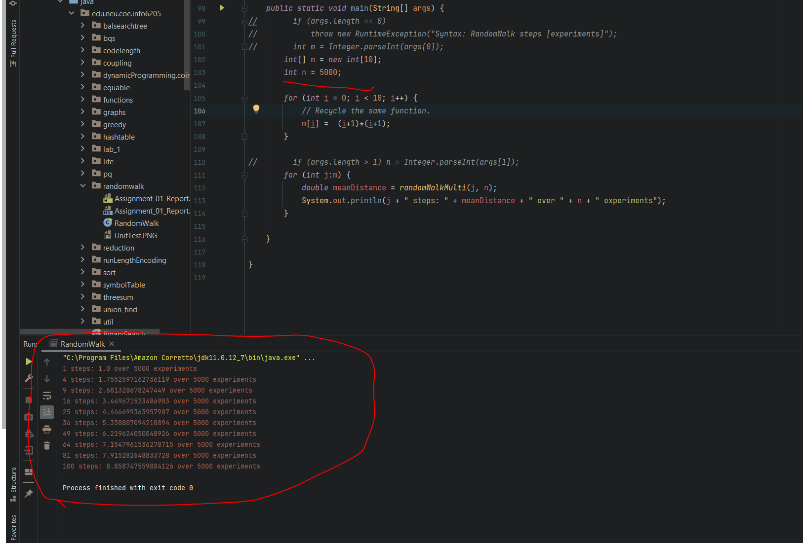
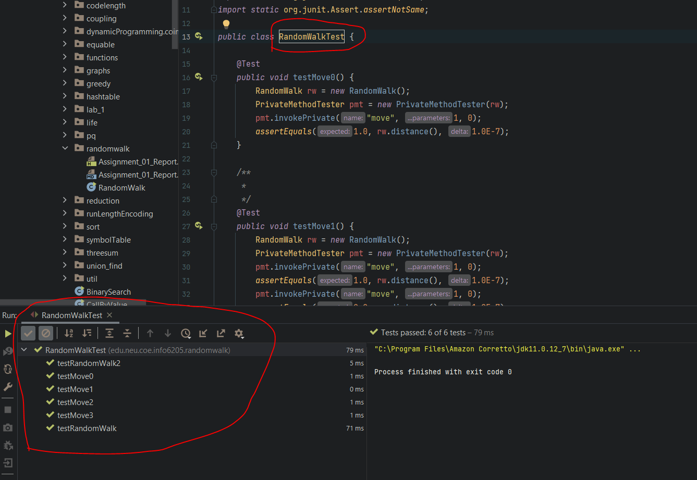

### `Noctis Yamazaki Zhang  (NUID: 002105657)          `

# INFO 6205 Program Structures & Algorithms [Fall 2021]

## Assignment 1 (Random Walk)

### 1. Your **conclusion** about the relationship between $d$ and $n$

$D \ = \ \sqrt[]{n} \ particularly \ when \ n \rightarrow \infin $.

### 2. Your **evidence** to support that relationship

 The result can be seen as:



When it comes to the random walk question, per the statement, the man has the ability to walk with a unit length of 1 in a 2-Dimensional space. (Unless he can fly with a rocket launcher I reckon?) Therefore, the distance $D$ shall consists of horizontal (Let's say, from the west to the east in this case.) component, plus the vertical (Evidently, it would be from the south to the north in this case.) component. We denote that $x_{i}$ represents the length of the horizontal component, and $y_{i}$ represents the vertical component.  Therefore, the distance $D$ can be expressed as:

$D \ = \ \sqrt[]{(\sum_{i=1}^{n}{x_{i}})^{2} \ + \ (\sum_{i=1}^{n}{y_{i}})^{2}} \ \ \ \ \ \ whereas \ x_{i} \ and \ y_{i} \ are \pm 1 \ since \ they \ are \ directional.$

Since my math skill sucks, please allow me to start focusing on one dimension at first, the horizontal, or from the west to the east you may say.

Let us denote the total of the horizontal component to be $D_{x}$, then we will have:

$D_{x} \ = \sum_{i=1}^{n}{x_{i}} \ = \ x_{1} \ + \ x_{2} \ + \ + \ ... \ + \ x_{n}$

If we say that there is $50-50$ chance for the man to walk $+ \ 1$ or $- \ 1$, then it makes no sense to claim that when $n \ \rightarrow \ \infin$, the average would go to $0$, which sounds like bullshit. However, do note that we are in a 2-Dimensional system, and we are trying to track how far the man has go from the origin location to the end point. Hence, we have to factor in the direction. Since $D_{x}$ can be positive or negative depending on the direction. In order to rule out the influence of direction, to some extent, we need to compute $D_{x}^{2}$ instead, since it is always going to be positive.

In this way, we can get the expression of  $D_{x}^{2}$ as:

$D_{x}^{2} \ = \ (\sum_{i=1}^{n}{x_{i}})^{2} \ = (\ x_{1} \ + \ x_{2} \ + \ + \ ... \ + \ x_{n})^{2} \\ = \ [\ (x_{1})^{2} \ + \ (x_{2})^{2} \ + \ + \ ... \ + \ (x_{n})^{2}) \ ] \ + \ 2 \ \times \ [ \ (x_{1}x_{2} \ + \ x_{1}x_{3} \ + \ + \ ... \ + \ x_{1}x_{n}) \ + \\ (x_{2}x_{3} \ + \ x_{2}x_{4} \ + \ + \ ... \ + \ x_{2}x_{n}) \ + \ ... \ + \ (x_{n-1}x_{n})] $

Let us consider $x_{i}$, since each value is either $+ \ 1$ or $- \ 1$, therefore, it is evident that $x_{i}^{2}$ is simply $1$. However, when it comes to the latter part of the expanded portion in the aforementioned expression, we can get a table to illustrate the possible outcomes of ${x_{i}x_{j}}$ whereas $i \ \in \ [1,n] , \ j \ \in \ [i,n] \ whereas \ both \ i \ and \ j \ are \ integers.$ 

| $x_{i}$ | $x_{j}$ | $x_{i}x_{j}$ |
| ------- | ------- | ------------ |
| 1       | 1       | 1            |
| -1      | 1       | -1           |
| 1       | -1      | -1           |
| -1      | -1      | 1            |

According to the table, we can see that $x_{i}x_{j}$ have $50-50$ chance to be either $+ \ 1$ or $- \ 1$. Then, we can conclude that when  $n \ \rightarrow \ \infin$, the sum of all $\sum_{i=1}^{n}\sum_{j=i}^{n}x_{i}x_{j}$ would be $0$. Hence, the previous expression of $D_{x}^{2}$ can be estimated as:

$D_{x}^{2} \ = \ [1 \ + \ 1 \ + \ ... \ + \ 1] \ + \ 2 \ \times \ 0 \ = \ n$

Similarly, if we look at the vertical direction, or from the south to the north in this case scenario, we will be able to yield:

$D_{y}^{2} \ = \ [1 \ + \ 1 \ + \ ... \ + \ 1] \ + \ 2 \ \times \ 0 \ = \ n$

The last step is to put them together to compute the square of the overall distance $D$, which can be expressed as $D^{2}$. Since there is $50-50$ chance for the man to walk either in horizontal or vertical direction. $P_{x} = \frac{1}{2}$ and $P_{y} = \frac{1}{2}$ 

$D^{2} \ = \ P_{x} D_{x}^{2} \ + \ P_{y}D_{y}^{2} \ = \ \frac{1}{2} \times n \ + \ \frac{1}{2} \times n \ = \ n $

To simply put, the expression of $D$ can be expressed as:

$D \ = \ \sqrt[]{n} \ particularly \ when \ n \rightarrow \infin $.

### 3. Your **code** (RandomWalk.java plus anything else that you changed or created)

In `RandomWalk.java`:

The following code is added:

```java
    /**
     * Private method to move the current position, that's to say the drunkard moves
     *
     * @param dx the distance he moves in the x direction
     * @param dy the distance he moves in the y direction
     */
    private void move(int dx, int dy) {
        // TO BE IMPLEMENTED
        // First, we need to know that x is the accumulation of dx.
        // And y is just the accumulation of dy

        x += dx;
        y += dy;

        // I think that should be it?
    }
```


```java
    /**
     * Perform a random walk of m steps
     *
     * @param m the number of steps the drunkard takes
     */
    private void randomWalk(int m) {
        // TO BE IMPLEMENTED
        // So we will have m iterations.
        for (int i = 0; i < m; i++){
            // Then we call out the randomMove I reckon?
            // Otherwise it is gonna be a clusterfuck.
            randomMove();
        }

    }
```


```java
    /**
     * Method to compute the distance from the origin (the lamp-post where the drunkard starts) to his current position.
     *
     * @return the (Euclidean) distance from the origin to the current position.
     */
    public double distance() {
        // TO BE IMPLEMENTED

        // Now we calculate the thing as:
        double dist_temp = Math.sqrt(Math.pow(x, 2) + Math.pow(y, 2));

        //return 0;
        // Instead of returning 0.
        return dist_temp;

    }
```

This code is used to generate the relationship table for ==Section 2==.

```java
    public static void main(String[] args) {
//        if (args.length == 0)
//            throw new RuntimeException("Syntax: RandomWalk steps [experiments]");
//        int m = Integer.parseInt(args[0]);
        int[] m = new int[10];
        int n = 5000;

        for (int i = 0; i < 10; i++) {
            // Recycle the same function.
            m[i] =  (i+1)*(i+1);
        }

//        if (args.length > 1) n = Integer.parseInt(args[1]);
        for (int j:m) {
            double meanDistance = randomWalkMulti(j, n);
            System.out.println(j + " steps: " + meanDistance + " over " + n + " experiments");
        }

    }
```

### 4. A screen shot of the unit tests all passing



